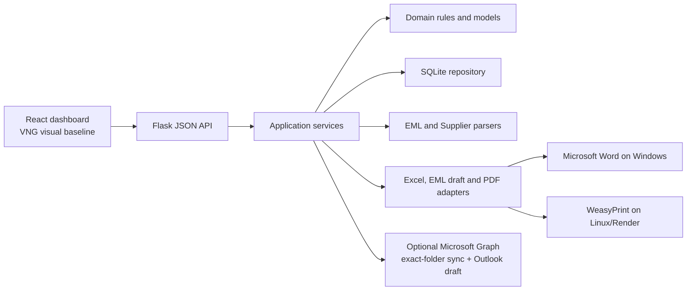
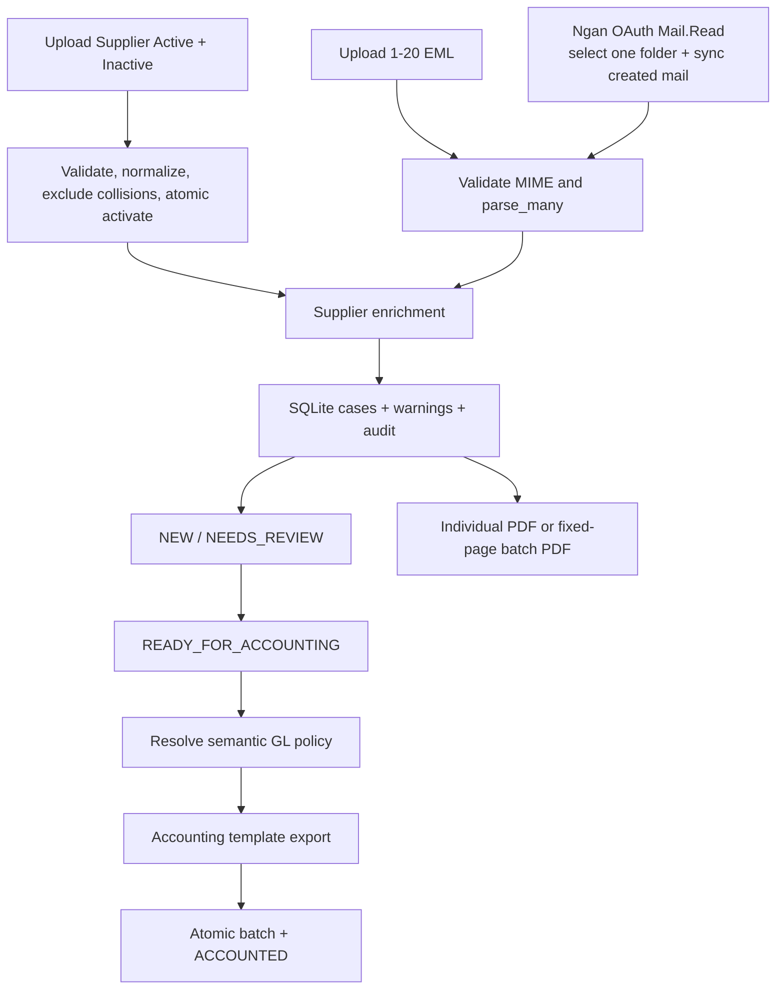
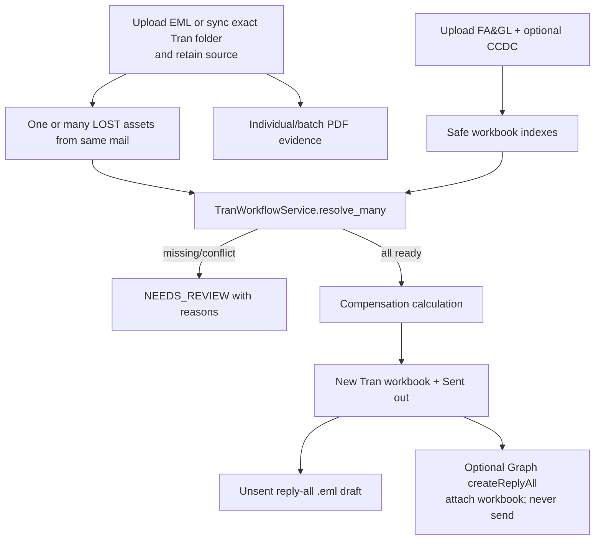
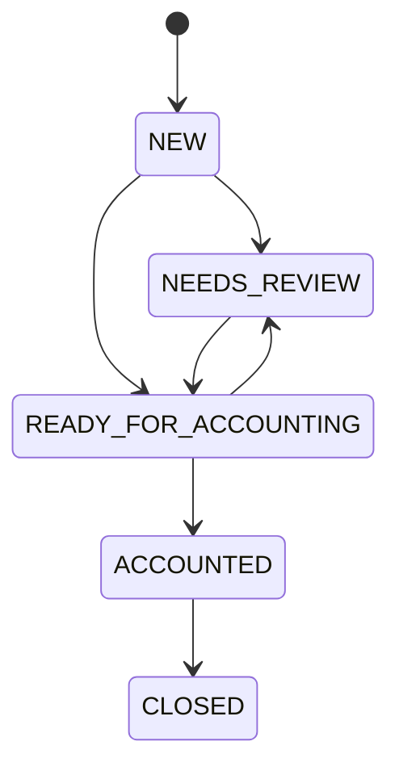

# Asset Compensation Hub — hồ sơ bàn giao toàn bộ dự án

> **AI START HERE.** Đây là tài liệu bàn giao chuẩn để một AI hoặc thành viên mới
> có thể tiếp tục dự án mà không cần lịch sử hội thoại cũ. Hãy đọc toàn bộ file
> này, sau đó đọc `AGENTS.md` và chạy các lệnh kiểm tra trạng thái ở mục 2 trước
> khi sửa code. Tài liệu này không thay thế source/test: nếu có mâu thuẫn, source
> và test ở commit hiện tại là nguồn sự thật kỹ thuật; cập nhật lại file này trong
> cùng PR.

Tài liệu được viết cho Codex, Claude Code, developer, tester và người vận hành.
Nó cố ý không chứa tên/email/mã tài sản/GL/mật khẩu/dữ liệu tài chính vận hành.
Những giá trị đó phải tiếp tục nằm ngoài Git và chỉ được cấu hình ở runtime.

## 1. Tóm tắt nhanh nhất

Asset Compensation Hub là product React + Flask dùng để xử lý hồ sơ đền bù tài
sản IT bị hư hỏng hoặc thất lạc. Product thay thế chuỗi script Python rời rạc
bằng một workflow có trạng thái, audit, kiểm tra dữ liệu và output có kiểm soát:

1. Upload Supplier Active + Inactive.
2. Upload email `.eml` hoặc, khi cấu hình Microsoft 365, kết nối mailbox riêng
   cho từng vai trò và sync email mới từ đúng một folder đã chọn; parser có thể
   tạo nhiều hồ sơ từ một email.
3. Review hồ sơ `DAMAGED`/`LOST`, cảnh báo và trạng thái.
4. Với NganTLT: xuất batch hạch toán theo template gốc và ghép PDF chứng từ.
5. Với TranNNB: upload FA&GL/CCDC, resolve tài sản, tính đền bù, xuất workbook
   cùng sheet `Sent out`, tạo draft mail chưa gửi dưới dạng `.eml` hoặc Reply-All
   trực tiếp trong Outlook qua Graph, và tạo/ghép PDF.
6. Lưu workflow/audit trong SQLite; file nguồn và output không phải database.

Kiến trúc hiện tại:



### Product đang ở đâu

Snapshot này được lập ngày **2026-08-15**:

| Hạng mục | Giá trị tại snapshot |
| --- | --- |
| GitHub | `AnhLNQ2202/DEN-BU-HU-HONG-THIET-BI` |
| Branch tích hợp | `agent/react-trannnb-team-dev` |
| Commit feature template/Draft Mail | `9e17959c9a1204fa94bf98cf065dc7fd9d1d7d18` |
| Commit đã CI và đang live trên Render | `cfa1dd05bf9209939b3dddda5e04efe5e4859253` |
| `main` tại snapshot | `58794f42955ceb396a254dedac60ceeda3ac1ce1` |
| PR feature | [PR #5](https://github.com/AnhLNQ2202/DEN-BU-HU-HONG-THIET-BI/pull/5), đã merge |
| Draft PR tài liệu hậu deploy | [PR #6](https://github.com/AnhLNQ2202/DEN-BU-HU-HONG-THIET-BI/pull/6) |
| Render staging | <https://asset-compensation-hub-staging.onrender.com> |
| Render plan | Free, filesystem tạm, một instance |
| Render auth | Basic Auth; user `judge`, password chỉ xem trong Render Environment |
| Render deploy quan sát gần nhất | Environment rebuild `cfa1dd0`, trạng thái **live** lúc 2026-08-15 16:00 GMT+7 |
| Health | `/api/health` trả `200`; `/` không có auth trả `401` |
| CI | Hai check `quality` của PR #5 trên exact commit đều `SUCCESS` |
| CI Linux exact commit | 251 test pass, 85% statement coverage |
| QA Windows độc lập | 249 pass, 2 skip theo capability/privilege môi trường |
| Frontend | Vite build ổn định, 47 modules |
| Release verdict | Đủ điều kiện staging; chưa phải production multi-user |

> **Release candidate M365/Tran performance đang ở working tree của branch
> `agent/react-trannnb-team-dev`.** Local final gate: Ruff pass; 328 tests
> collected, 326 pass + 2 expected platform skips; coverage 84%; Vite 48 modules và hai lần
> build byte-for-byte ổn định. Exact Git commit/CI còn chờ bước publish cuối của
> root agent. Release mới **chưa được deploy Render**; phải hỏi lại user ngay
> trước redeploy vì `/tmp` staging sẽ mất dữ liệu.

Các giá trị trên là snapshot, không phải chân lý vĩnh viễn. AI mới phải kiểm tra
lại bằng các lệnh ở mục 2.

## 2. Việc AI mới phải làm đầu tiên

Từ thư mục repository:

```powershell
git status -sb
git branch --show-current
git log -5 --oneline --decorate
git remote -v
gh auth status
gh pr list --head (git branch --show-current) --state all
```

Xác định thư mục gốc mà không hard-code username máy:

```powershell
$repoRoot = git rev-parse --show-toplevel
$originalRoot = Split-Path $repoRoot -Parent
```

Quy tắc trước khi sửa:

- Không làm việc nếu chưa hiểu `git status`; thay đổi lạ thuộc về người dùng.
- Repository nằm **bên trong** workspace gốc. Mọi file vận hành ở `$originalRoot`
  phải được coi là read-only, trừ khi user chỉ rõ chính xác file và hành động.
- Không sao chép EML/PDF/Supplier/Office/SQLite thật vào repository, fixture,
  prompt, log, screenshot hoặc PR.
- Không đưa exact operational GL, org ID, domain nhân viên hay số tiền nguồn vào
  Git. Dùng key semantic và fixture synthetic.
- Không hand-edit `src/asset_compensation/web/static/dist`; chạy Vite build.
- Sau thay đổi: test, review diff, commit có chủ đích và push branch hiện tại.
  User đã yêu cầu AI tự push khi phần việc thực sự hoàn thành. Mặc định cập nhật
  draft PR; không tự merge vào `main` và không tự deploy production trả phí.

## 3. Mục tiêu và các quyết định không được tự ý đảo ngược

### 3.1 Mục tiêu người dùng

- Biến tool nội bộ ban đầu thành một product gọn, dễ dùng, dễ bảo trì và dễ mở
  rộng cho hackathon.
- Chuyển frontend sang React nhưng **giữ giao diện dashboard ban đầu** làm visual
  baseline.
- Giữ template/format output ban đầu; không tự thiết kế workbook khác.
- Mang các rule và chức năng hợp lệ của tool gốc vào product, đồng thời loại bỏ
  hành vi nguy hiểm như ghi đè, đoán dữ liệu, cắt PDF âm thầm hoặc gửi email tự
  động.
- Có staging rẻ để team cùng test; có hướng dẫn Codex/Claude cho mỗi máy.
- Không làm mất hoặc di chuyển file gốc.
- Khi hoàn tất một thay đổi đã được kiểm tra, AI chủ động commit/push GitHub và
  cập nhật tài liệu bàn giao này.

### 3.2 Hợp đồng UI

Nguồn visual ban đầu là `dashboard_template.html` trong workspace cha, không
phải artifact `dashboard.html` được generate. React phải giữ các dấu hiệu chính:

- logo VNG và màu cam/xanh/vàng;
- nền warm off-white;
- tabs `Tổng quan` và `Task`;
- task selector `NganTLT`/`TranNNB`;
- sáu KPI compact;
- bảng header tối, zebra rows, hàng warning/done;
- bộ lọc và bố cục thao tác inline;
- VI/EN và hành vi responsive hiện có.

Có thể cải thiện accessibility, validation, loading, progress, toast và responsive
nhưng không được đổi sang một dashboard SaaS tối màu/khác nhận diện nếu user
không yêu cầu.

### 3.3 Hợp đồng output

- Accounting dùng template 30 cột, giữ sheet/header/style/archetype; `.xlsm` đã
  được phê duyệt có thể giữ VBA khi cấu hình external template.
- Tran dùng year sheet 22 cột và `Sent out` 15 cột theo template gốc.
- PDF batch có tên tải xuống `chungtu_<GN2ddmmyy>.pdf` khi có batch hợp lệ.
- Không ghi đè source template hoặc output đã tồn tại.
- Không bundle file vận hành thật hoặc macro chưa audit vào Git/Docker.
- Built-in templates chỉ là bản sạch, không có PII, GL thật, VBA hay dữ liệu
  vận hành.

### 3.4 Hành vi an toàn cố ý khác tool cũ

- Không dynamic-import script tùy ý và không dựa vào marker stdout subprocess.
- GET không được mutate `case_log.xlsx` hoặc filesystem.
- Không chọn Supplier/reference bằng glob “file đầu tiên”.
- Không scan mọi Outlook mailbox: mỗi role OAuth riêng chỉ sync đúng một folder
  đã chọn. Không request `Mail.Send`, không có Graph `/send` và không tự gửi mail.
- Không chèn raw HTML vào mail.
- PDF overflow mặc định fail; chỉ cắt khi user chọn rõ `warn`, và phải trả warning.
- Dữ liệu thiếu/không rõ trả `NEEDS_REVIEW`; không đoán physical, lookup, cost,
  ngày bắt đầu, depreciation group hoặc fee.
- Mismatch tài chính bị reject thay vì chỉ tô đỏ một workbook sai.

## 4. Người dùng và hai workflow chính

### 4.1 Vai trò thực tế

| Vai trò | Công việc chính |
| --- | --- |
| NganTLT/accounting operator | Nạp Supplier + email bằng upload hoặc mailbox OAuth riêng (`Mail.Read`), review case, tạo batch hạch toán, tải workbook, tạo/ghép PDF chứng từ |
| TranNNB/compensation operator | Nạp email bằng upload hoặc mailbox OAuth riêng (`Mail.ReadWrite`), nạp FA&GL/CCDC, xác minh classification, tính đền bù, xuất workbook/`Sent out`, tạo draft `.eml`/Outlook và PDF |
| Reviewer | Xử lý cảnh báo, chuyển trạng thái, kiểm tra audit và output |
| Team developer/tester | Chạy local/devcontainer/Compose hoặc staging bằng fixture synthetic |
| Hackathon judge | Xem dashboard staging qua Basic Auth; không có quyền riêng theo vai trò trong MVP |

### 4.2 Luồng NganTLT



Thứ tự vận hành:

1. Upload đúng một file Active và một file Inactive.
2. Upload `.eml`, hoặc kết nối account Ngan Microsoft 365 và chọn đúng một folder
   rồi sync. Một EML có thể sinh nhiều case; các case cùng email dùng chung opaque
   retained handle khi retention bật. Sync Graph vẫn chạy qua validator/parser/
   Supplier enrichment hiện có; không có parser riêng dễ lệch rule.
3. Review warnings và dữ liệu case. UI chỉ cho transition theo policy backend.
4. Chuyển case hợp lệ sang `READY_FOR_ACCOUNTING`.
5. Chọn case, nhập batch dạng `GN2ddmmyy`, actor và `invoice_start` từ 0 đến
   999999.
6. Backend resolve policy, export workbook mới, rồi ghi batch + chuyển case sang
   `ACCOUNTED` trong một transaction. Một case chỉ được thuộc một batch.
7. Từ panel PDF, chọn tối đa 20 email duy nhất, 1–10 trang/email, chọn `fail` hoặc
   `warn`, sau đó tải PDF riêng hoặc file ghép.

### 4.3 Luồng TranNNB



Chi tiết:

1. Upload EML ở phân hệ TranNNB, hoặc kết nối account Tran Microsoft 365 và sync
   đúng một folder. UI chọn một mail nguồn sẽ tự nhóm các case có cùng retained
   EML và bung từng `metadata.asset_rows` thành danh sách 1–100 tài sản. Một case
   LOST cùng domain có thể đại diện nhiều dòng tài sản, không được coi một case
   luôn tương đương một tài sản.
2. Upload một FA&GL `.xlsx`; CCDC `.xlsx` là optional. Managed upload ưu tiên
   hơn path external cấu hình bằng env.
3. Resolve từng tài sản. UI chỉ prefill trường thật sự có trong parser metadata;
   không dùng ngày nhận mail làm ngày mất và không dùng compensation amount làm
   original cost.
4. Nếu lookup/classification/cost/date không đủ hoặc conflict, result chưa ready
   và nêu reasons/provenance. User có thể nhập confirmation được rule cho phép.
5. Khi tất cả ready, xuất workbook mới theo template Tran và rebuild `Sent out`
   chỉ từ request hiện tại.
6. Nếu retention + sender đã cấu hình, tạo draft RFC822 Reply-All với `X-Unsent: 1`.
   Product không có send endpoint. Bảng HTML dùng contract mail 15 cột riêng của
   TranNNB (không dùng lại tên header nội bộ của `Sent out`): header `#9CC2E5`,
   cột tổng tiền `#FFFF00`, border đen 1 px, Arial 12 px, padding 4 px × 8 px,
   alignment theo từng nhóm cột và dòng Total in đậm cộng G/H/I đúng mẫu gốc.
   Lời mở đầu luôn do operator nhập nội dung đã được duyệt; product không tự thêm
   `Dear all` hoặc câu mẫu. Mail nguồn được quote bên dưới dưới dạng text đã escape,
   tối đa 100.000 ký tự; HTML chủ động, form, script và tài nguyên từ xa của mail
   nguồn không được đưa nguyên trạng vào draft.
7. Khi account Tran đã kết nối, product còn có thể đọc exact `Message-ID` từ EML
   đã retain, tìm **đúng một** message trong mailbox `/me`, gọi Graph
   `createReplyAll`, prepend intro đã escape + cùng bảng Tran, attach workbook mới
   và trả Outlook web link đã allowlist. Nếu update/attach lỗi, service cố xóa
   draft tạm và báo rõ khi rollback không chắc chắn. Quyền là `Mail.ReadWrite`
   vì Graph cần nó để tạo draft; product không xin `Mail.Send` và không gửi.
8. Cùng retained EML có thể dùng cho PDF. Draft của một nhóm nhiều tài sản chỉ
   cho phép khi mọi dòng dùng cùng source handle. Mỗi asset draft mang binding
   `{case_id, source_row_index}`; `case_id` được lặp với row index khác nhau,
   nhưng composite không được trùng. Server đối chiếu Tag/Domain với đúng dòng
   nguồn, còn UI khóa hai field này; case `ACCOUNTED/CLOSED` không được tạo output
   draft mới.

### 4.4 Hợp đồng Microsoft 365 chung cho hai vai trò

- Một browser session có **hai token cache độc lập**; Connect luôn dùng account
  chooser để Ngan và Tran có thể chọn hai email khác nhau trong cùng tenant.
- Ngan xin đúng delegated `Mail.Read`; Tran xin đúng `Mail.ReadWrite`. Không có
  `Mail.Send`, shared mailbox, application permission, cross-tenant hoặc send API.
- Graph dùng `/me`, vì vậy mỗi connection chỉ truy cập mailbox của account đang
  đăng nhập. MVP không hỗ trợ shared mailbox/delegated mailbox khác.
- Mỗi role chọn một exact folder. First sync chỉ lấy created messages trong 30
  ngày gần nhất; sau đó dùng folder delta cursor. Mỗi request đúng một bounded
  delta page, tối đa 10 mail, 2 MiB/mail và 25 MiB tổng; `has_more=true` yêu cầu
  sync tiếp. Moved/deleted 404, MIME quá 2 MiB và MIME invalid được skip
  count-only, không fallback ra ngoài folder và không poison cursor.
- Khi bất kỳ case từ một exact MIME đã `ACCOUNTED/CLOSED`, MIME đó là idempotent
  no-op dù tên file vận chuyển thay đổi giữa các lần Graph sync; provenance đã
  hạch toán được giữ nguyên. Trước khi hạch toán, re-ingest vẫn refresh Supplier
  và parser-owned fields. Cùng Message-ID nhưng bytes khác luôn fail closed.
- UI có opt-in auto-sync 5 phút chỉ khi dashboard tab đang mở và visible, mặc
  định tắt. Đây là browser timer; server báo `background_sync:false` và không có
  worker/webhook/subscription nền.
- OAuth session, MSAL token cache, selected folder và delta cursor chỉ ở process
  memory. Session có absolute TTL 8 giờ, OAuth flow 10 phút, tối đa 512 browser
  sessions; restart/redeploy/multi-worker làm mất state và phải reconnect/reselect.
- Disconnect xóa state local của đúng role, không revoke Entra consent. Authorized
  test reset xóa **mọi** M365 session/cursor in-memory cùng dữ liệu staging.
- Chi tiết Entra/Render/API/error/safety ở `docs/MICROSOFT_365.md`.

## 5. Kiến trúc và bản đồ source

### 5.1 Nguyên tắc phân lớp

| Lớp | Trách nhiệm | Không được làm |
| --- | --- | --- |
| `domain/` | DTO, enum, validation, pure business entities/rules | I/O, Flask, database, Excel |
| `services/` | Orchestration, policy, transactional use cases | HTML UI, đường dẫn client tùy ý |
| `parsers/` | EML/Supplier → structured data, exact financial parsing | Persist hoặc gọi exporter |
| `adapters/` | Excel/PDF/mail/reference file implementation | Quyết định workflow/status |
| `repositories/` | SQLite persistence and transactions | Parse mail hoặc render output |
| `web/` | HTTP validation, auth, response serialization, dependency composition | Nhúng business rule mới trong route |
| `frontend/` | React UI, state, API client, validation UX | Tự tính rule tài chính authoritative |

### 5.2 File map quan trọng

| Path | Vai trò |
| --- | --- |
| `run.py` | Entrypoint production-compatible |
| `src/asset_compensation/config.py` | Toàn bộ runtime settings/env và managed paths |
| `src/asset_compensation/cli.py` | CLI init/serve/ingest |
| `src/asset_compensation/domain/models.py` | `Case`, status/type, batch, history, summary |
| `src/asset_compensation/domain/compensation.py` | Input/result/enums của Tran compensation |
| `src/asset_compensation/services/case_service.py` | Stable IDs, ingest, transition, batch lifecycle |
| `src/asset_compensation/services/ingestion_service.py` | Directory/payload ingestion và enrichment |
| `src/asset_compensation/services/compensation_service.py` | Pure Tran calculation policy |
| `src/asset_compensation/services/tran_workflow_service.py` | Reference resolution + calculation orchestration |
| `src/asset_compensation/services/accounting_policy.py` | Semantic policy key → configured account mapping |
| `src/asset_compensation/services/supplier_upload_service.py` | Safe Supplier version upload/activation |
| `src/asset_compensation/services/tran_reference_upload_service.py` | Safe FA&GL/CCDC version upload/activation + bounded generation-consistent index cache |
| `src/asset_compensation/services/m365_auth_service.py` | Role/session-isolated MSAL cache, OAuth, folder selection và bounded delta collection |
| `src/asset_compensation/services/m365_mail_service.py` | Graph MIME → existing ingestion pipeline; Outlook Reply-All draft orchestration/rollback |
| `src/asset_compensation/services/mail_artifact_service.py` | Optional content-addressed EML retention |
| `src/asset_compensation/services/mail_pdf_service.py` | Atomic individual/batch PDF orchestration |
| `src/asset_compensation/services/test_data_service.py` | Scoped disposable staging cleanup |
| `src/asset_compensation/parsers/eml.py` | Multi-record DAMAGED/LOST parser and skip rules |
| `src/asset_compensation/parsers/suppliers.py` | CSV/XLSX/Oracle-BIP HTML Supplier readers |
| `src/asset_compensation/adapters/accounting_template.py` | Original 30-column accounting exporter |
| `src/asset_compensation/adapters/accounting_xlsx.py` | Standalone/general adapter; web runtime hiện không compose adapter này |
| `src/asset_compensation/adapters/tran_reference_xlsx.py` | FA&GL and CCDC indexes |
| `src/asset_compensation/adapters/tran_workbook.py` | Tran year sheet + `Sent out` exporter |
| `src/asset_compensation/adapters/tran_mail.py` | Escaped HTML table and unsent EML draft |
| `src/asset_compensation/adapters/m365_contract.py` | Shared Graph/Outlook body hard limits |
| `src/asset_compensation/adapters/m365_graph.py` | Strict allowlisted Graph HTTP boundary; không generic request/send method |
| `src/asset_compensation/adapters/pdf.py` | EML sanitizer, Word/Weasy converters, pypdf normalization/merge |
| `src/asset_compensation/repositories/sqlite_repository.py` | Schema, WAL, transactions, immutable accounted cases |
| `src/asset_compensation/web/app.py` | Flask app factory, auth, headers, dependency wiring |
| `src/asset_compensation/web/routes.py` | HTTP contract and serialized mutating endpoints |
| `frontend/src/App.jsx` | Dashboard top-level state/navigation/data refresh |
| `frontend/src/api.js` | Backend API client and response normalization |
| `frontend/src/i18n.js` | VI/EN strings |
| `frontend/src/styles.css` | VNG/original visual contract and responsive layout |
| `frontend/src/components/UploadWorkspace.jsx` | Supplier + EML upload, progress/cancel/reset state |
| `frontend/src/components/TaskWorkspace.jsx` | NganTLT accounting and PDF workspace |
| `frontend/src/components/TranWorkspace.jsx` | Multi-asset Tran reference/resolve/export/draft UI |
| `frontend/src/components/M365MailboxPanel.jsx` | Role account/folder/manual sync + visible-tab 5-minute opt-in auto-sync |
| `frontend/src/components/MailPdfPanel.jsx` | Artifact selection and individual/batch PDF UI |
| `frontend/src/components/CaseTable.jsx` | Filtered case table and selection |
| `frontend/src/components/CaseDrawer.jsx` | Detail, metadata and status audit timeline |
| `frontend/src/components/BatchDialog.jsx` | Batch validation, actor, invoice start |
| `src/asset_compensation/templates/*.xlsx` | Accounting template synthetic sạch và Tran template giữ layout/style gốc nhưng đã loại toàn bộ dữ liệu vận hành |
| `src/asset_compensation/web/static/dist/` | Generated Vite bundle served by Flask |

## 6. Domain model, trạng thái và persistence

### 6.1 Case fields

`Case` gồm:

- identity: `id`, `case_type`, `domain`, `asset_code`;
- workflow: `status`, `created_at`, `updated_at`;
- person/asset display: `employee_name`, `asset_name`;
- finance: `amount`, `residual_value`, `responsibility_fee` — integer whole VND,
  không âm, tối đa JS-safe integer;
- damaged detail: `repair_status`;
- Supplier: `supplier_number`, `supplier_site`, `supplier_name`;
- evidence/data quality: `warnings`, `source_file`, `metadata`;
- audit riêng trong `StatusEvent`: from/to, actor, note, changed_at.

Parser tạo `ParsedCase`; `CaseService` sinh ID deterministic từ case type +
normalized domain + asset code + source identity. Mutable amount không nằm trong
ID, nên re-ingest cùng nguồn là idempotent.

Đây là intentional divergence với mã tuần tự theo tháng của `case_dashboard.py`
gốc. Không đổi stable identity về counter chỉ để đẹp UI; nếu business cần số hồ
sơ dễ đọc/tuần tự, thêm display/reference number riêng với migration và uniqueness
contract, giữ stable ID làm technical key.

### 6.2 Status machine



- Transition khác bị backend reject.
- Mỗi transition ghi `status_events` với actor/note.
- Case `ACCOUNTED`/`CLOSED` bị đóng băng financial/source fields; re-ingest khác
  dữ liệu sẽ fail thay vì làm workbook đã phát hành lệch database.
- Batch finalization và transition tất cả case sang `ACCOUNTED` là một SQLite
  transaction.
- Unique index `batch_items(case_id)` ngăn một case vào hai batch.
- Các HTTP mutation quan trọng dùng process-wide `RLock` để tránh race giữa
  upload/export/reset. SQLite dùng `BEGIN IMMEDIATE`, foreign keys, WAL cho file
  database và `busy_timeout=5000`.

### 6.3 SQLite schema

| Table | Nội dung |
| --- | --- |
| `cases` | One row/case, JSON cho warnings/metadata, enum checks và amount checks |
| `status_events` | Append-only audit transition, cascade khi case được xóa có chủ đích |
| `batches` | Unique batch name, created_at, JSON metadata/output name |
| `batch_items` | Ordered case membership, unique case globally |

SQLite là source of truth cho workflow. `case_log.xlsx` của tool cũ không còn là
database và không được tự động rewrite.

### 6.4 Managed runtime layout

Mặc định local là `var/`; cloud lấy từ `ASSET_HUB_DATA_DIR`:

```text
<data_dir>/
├── asset_hub.sqlite3
├── inbox/                         # legacy explicit server-side ingest
├── outputs/
│   ├── tran/                      # generated Tran workbook/draft
│   └── mail-pdfs/                 # standalone and batch PDF
├── reference/                     # app-managed Supplier/FA&GL/CCDC versions
└── private-mail-artifacts/        # optional SHA-256 EML store
```

Cleanup chỉ được xóa managed paths/patterns mà app sở hữu. Không recurse vào
workspace cha, inbox bên ngoài, template external hoặc file lạ.

Microsoft 365 token cache/folder/delta cursor **không nằm trong layout này** và
không persist vào SQLite/file/cookie. Cookie chỉ chứa opaque 43-character session
ID; state/tokens/cursors ở memory và bị drop khi process restart hoặc test clear.

## 7. Business rules chi tiết

### 7.1 Ingestion/Supplier

- Supplier upload bắt buộc cặp Active + Inactive; nhận `.csv`, `.xlsx`, hoặc
  Oracle BI Publisher UTF-8 HTML mang extension `.xls`.
- Mỗi file tối đa 20 MiB, tổng tối đa 48 MiB; source tối đa 20.000 data rows,
  32 columns và 640.000 cells.
- XLSX bị reject nếu encrypted, VBA, embedded object, external relationship/link,
  unsafe ZIP path, duplicate entry, expansion/compression bất thường.
- Oracle HTML phải có signature đúng; binary OLE `.xls` không được đọc.
- Domain thật được ưu tiên. Với Oracle legacy, chỉ derive từ suffix `-domain`
  cuối Supplier Name. `Employee Number` là identity check, không thay domain.
- Identity gồm Supplier Number + Employee Number + Site + name + active state.
  Conflict Active/Inactive hoặc nhiều identity cùng normalized domain bị loại khỏi
  lookup và báo ambiguous; không ưu tiên “dòng đầu” hay Active một cách im lặng.
- Raw Supplier upload bị xóa trước activation. App chỉ giữ normalized minimized
  snapshot và collision metadata; pointer version đổi atomic và có round-trip
  signature validation.
- EML upload nhận 1–20 file `.eml`, tối đa 2 MiB/file và 25 MiB/request. Header,
  MIME depth/part/text/image đều bounded; archive/attachment không cho phép.
- Parser decode subject, chọn bounded plain/HTML, hỗ trợ nhiều DAMAGED record và
  nhiều LOST table row/group theo domain. MOU asset prefix vẫn hợp lệ; chỉ mail
  standalone marker MOU/technical/no-compensation mới bị skip có reason.
- Whole-VND parsing là exact; fractional, malformed hoặc vượt giới hạn bị reject,
  không round.
- Message-ID được hash; cùng ID nhưng khác content buộc review thay vì overwrite.
- Metadata HTTP lưu theo hướng data-minimized: không persist raw Subject/Sender/
  Message-ID. Tên upload trở thành `upload-XX.eml`; retained case chỉ nhận opaque
  handle + safe basename.
- Inactive Supplier được thể hiện bằng metadata/warning để accounting highlight;
  ambiguous/not-found không được giả lập thành matched.

### 7.2 NganTLT accounting policy

Parser không chứa GL vận hành. Nó phát semantic policy keys:

- `ASSET_COMPENSATION_PREPAYMENT`;
- `DAMAGED_REPAIR`;
- `DAMAGED_NO_REPAIR`;
- `LOST_DEPRECIATION_ASSET`;
- `LOST_DEPRECIATION_OTHER`;
- `LOST_RESPONSIBILITY`;
- `LOST_FALLBACK`.

`AccountingPolicyResolver` là boundary duy nhất đổi key thành account runtime.
Account template chỉ được dùng placeholders `{cost_center}`, `{product_code}` và
`{location}`, mỗi dimension phải match allowlist. Không thêm GL thật vào source.

Quy tắc chính:

- Case amount phải là whole VND **lớn hơn 0**.
- DAMAGED phải có repair status đã xác minh; repaired và not-repaired dùng hai
  policy khác nhau.
- LOST dùng `credit_components` nếu parser có table chi tiết; từng line mang
  policy + amount + dimensions. Tổng credit phải bằng case amount.
- Nếu không có components nhưng có residual + responsibility, split theo hai
  policy; nếu không thì fallback policy.
- Entity non-default có thể tạo green highlight; inactive employee tạo yellow
  prepayment highlight.
- `resolve_many` giữ thứ tự ổn định: tất cả DAMAGED trước, sau đó LOST.
- Batch name phải theo `GN2ddmmyy`; invoice date derive từ batch. `invoice_start`
  cho phép 0–999999 và được truyền từ React tới exporter.
- Exporter kiểm đúng 30 headers, clone style chứ không clone business values,
  escape formula-like cell text, reconcile source/journal/debit-credit và không
  clobber destination.

Các mapping GL và org ID demo trong source chỉ là placeholder. Production phải
inject giá trị Finance phê duyệt qua env; không được suy ra từ file lịch sử rồi
commit.

### 7.3 TranNNB compensation policy

Mọi phép tính nằm trong `CompensationService`; API/UI không tự tái hiện rule.
Fail-closed ordering:

1. `physical` phải được xác minh. `false` → `NOT_APPLICABLE`; missing → review.
2. Reference lookup phải `MATCHED` đúng một record; missing/not-found/ambiguous →
   review.
3. Physical item cần verified cost và start date; cost `0` → review, không xem là
   đền bù 0.
4. Tính thời gian dùng bằng Excel-compatible European
   `DAYS360(start,end,TRUE) / 30`, round half-up thành tháng.
5. Áp exemption **trước** group/fee: cost dưới 500.000 VND và đã dùng ít nhất
   12 tháng → `EXEMPT`, total 0.
6. Resolve depreciation group theo barcode. Unknown barcode chỉ được tiếp tục
   khi user xác minh group + fee và `classification_confirmed=true`.
7. Conflict giữa confirmation và mapping chuẩn → review, không override im lặng.
8. Remaining value và responsibility fee đều round half-up whole VND; total là
   tổng hai phần.

Nhóm 4 năm:

`ADA, BAT, CAB, CDW, COL, EHD, GAM, HEA, IHD, IPO, KEY, MOU, NET, PEN, POW, RAM,
SWA, TAB, UPS, USB, VGA, WRI`

Nhóm 6 năm:

`APT, CAM, CPU, FIW, LAP, LEN, MOD, MON, NAL, NAP, NAS, PHO, PJP, PRI, PRJ, ROU,
SCA, SHR, SWI, TPC`

Barcode có company data và fee 30%:

`CPU, EHD, IHD, LAP, PHO, TPC, USB`

Các barcode vật lý đã biết khác dùng fee 5%.

Schedule:

- 4 năm: 50%, 30%, 10%, 10%; implementation giữ historical flat 10% ở phần
  cuối theo workbook được phê duyệt.
- 6 năm: 20%, 20%, 20%, 10%, 10%, 10% cộng flat year-7 10% để đủ 100% theo rule
  vận hành lịch sử.
- Cost dưới threshold nhưng dùng dưới 12 tháng thường dùng group 4 năm; nếu
  barcode chuẩn lại thuộc 6 năm thì bắt review exception.

Numerical parity đã kiểm bằng workbook lịch sử nhưng không publish row vận hành:
25/25 formula rows, 7/7 exemption rows và 32/32 fee rows khớp. FA&GL lookup,
workbook/`Sent out`/draft đã có synthetic regression. Chưa có CCDC thật trong
workspace để certification production; cần UAT với file tổ chức đã phê duyệt.

### 7.4 Reference lookup Tran

- FA&GL là bắt buộc, contract bốn sheet; index tìm tag và trả provenance.
- Asset Number là identity mạnh hơn Tag vì Tag có thể duplicate; lookup phải xét
  Book/retirement/entity/dimensions và trả ambiguous khi không unique.
- CCDC optional dùng Define/CMDB/BC Xuatkho để classification và earliest start
  date theo contract adapter.
- Managed upload chỉ nhận `.xlsx`, tối đa 50 MiB/file, reject VBA, DDE/OLE,
  ActiveX/embedding, external formula/defined name, HTTP/external relationship,
  unsafe ZIP/zip bomb và validate index trước atomic switch. Ngoại lệ duy nhất là
  metadata `externalBook` trỏ `file:` đã được chứng minh mồ côi: đúng schema,
  không cache data/công thức/name, và adapter luôn đọc với `keep_links=False`.
- Omit CCDC để giữ current; gửi exact `clear_ccdc=true` để bỏ managed CCDC ở
  version mới.
- External env references là read-only; managed upload được ưu tiên.
- CCDC read-only parser dùng bounded one-pass `iter_rows(values_only=True)` cho
  header/data thay vì gọi `ReadOnlyWorksheet.cell()` lặp lại. Cách cũ khiến
  openpyxl reparse stream nhiều lần và thể hiện O(n²)-like slowdown ở file lớn.
- `TranReferenceUploadService` giữ tối đa một generation FA&GL + CCDC đã validate
  trong memory. Upload managed thành công prime đúng index vừa validate; upload
  lỗi giữ generation trước; clear invalidates; các route resolve/export dùng
  cùng service cache thay vì parse workbook lại mỗi action.
- External fallback được key bằng resolved path + stat signature và kiểm cả cặp
  trước/sau load. Cache chỉ publish khi FA&GL/CCDC cùng ổn định, nên thay file giữa
  hai load không thể tạo mixed generation; concurrent miss được single-flight bởi
  service lock.
- Mỗi reference sheet bị chặn ở 200.000 rows; tổng scan FA&GL và CCDC riêng bị
  chặn ở 300.000 rows, mỗi index tối đa 200.000 records. Tag tối đa 255 ký tự và
  text reference tối đa 1.024 ký tự. Các ceiling này cao hơn nhiều snapshot vận
  hành đã audit nhưng chặn sparse-sheet 1.048.576 rows và cache phình vô hạn trên
  worker 512 MiB.
- Benchmark **synthetic** 600 CCDC rows trên máy dev giảm từ 20.417 giây xuống
  0.073 giây, xấp xỉ 280×. Đây là bằng chứng diagnostic cho hotspot đã sửa,
  không phải SLA hoặc cam kết tốc độ với mọi workbook/máy.

### 7.5 PDF evidence

Pipeline:

1. `MailArtifactStore` resolve opaque `eml-sha256-<64 hex>` và verify hash.
2. `prepare_eml_document` decode subject/body, allowlist HTML, remove script,
   form, event handler, remote/local URL, active SVG và unsafe CSS; safe raster
   CID được embed data URI.
3. Windows: `WordPdfConverter` dùng private hidden Word instance, landscape và
   table autofit khi cần. Không bám/đóng Word instance của user.
4. Linux/Render: `WeasyPrintPdfConverter` dùng Pango/DejaVu tiếng Việt, chỉ cho
   `data:` resource, không HTTP/local fetch, validate output với pypdf.
5. `PypdfPageNormalizer` pad blank page nếu ngắn. Nếu dài: mặc định `fail`; chỉ
   policy `warn` mới truncate và trả số trang/warning.
6. `PypdfMerger` merge mọi normalized page.
7. Service stage toàn bộ batch rồi atomic publish; lỗi giữa chừng không để batch
   nửa vời và không overwrite.
8. Tên file tạm của Word/WeasyPrint/normalizer/merger và thư mục staging đều có
   prefix ngắn, bounded; tên output cuối vẫn giữ nguyên contract. Điều này tránh
   lặp lại tên batch dài và chạm giới hạn đường dẫn trên máy Windows của team.

Bounds/API:

- individual: một retained handle;
- batch: 1–20 handle unique, 1–10 pages/mail;
- cloud source mặc định tối đa 25 MiB, PDF 32 MiB, 100 rendered pages, embedded
  image 150 DPI;
- tất cả download chứa dữ liệu nhạy cảm dùng `Cache-Control: private, no-store`;
- Word và WeasyPrint có thể khác pagination. Dùng Word worker đã duyệt nếu cần
  pixel-level legacy fidelity; cloud renderer là lựa chọn staging an toàn.

## 8. API HTTP đầy đủ

Mặc định mọi route trừ `/api/health` đi qua shared Basic Auth nếu hai biến access
được cấu hình. Upload dùng thêm custom header để chống cross-site form dùng
browser-cached Basic Auth. Error business trả JSON; capability không có trả 503
với `capability_available:false`.

| Method | Route | Mục đích/contract ngắn |
| --- | --- | --- |
| GET | `/` | Flask shell tải React SPA |
| GET | `/api/health` | Public constant health; không lộ mode/case count |
| GET | `/api/dashboard` | Summary, cases, issues, batches, capabilities |
| GET | `/api/capabilities` | Feature flags + data-minimized Tran reference status |
| GET | `/api/cases` | Filter type/status/domain/warnings/source + limit/offset |
| GET | `/api/cases/<case_id>` | Case detail + status history |
| PATCH | `/api/cases/<case_id>/status` | Validated transition với actor/note |
| POST | `/api/compensation/preview` | Pure preview cho 1–100 assets; không persist |
| POST | `/api/demo/reset` | Reset synthetic demo, chỉ khi demo mode bật |
| POST | `/api/test-data/clear` | Guarded disposable cleanup với exact header/body |
| GET | `/api/suppliers/status` | Active normalized Supplier version/status |
| POST | `/api/suppliers/upload` | Multipart Active + Inactive; header `supplier-v1` |
| POST | `/api/emails/upload` | Multipart repeated `files`; header `email-v1`; ingest ngay |
| POST | `/api/ingest` | Legacy explicit server inbox ingestion |
| GET | `/api/m365/<role>/status` | `ngan|tran`; configured/account/folder/cursor, storage `memory`, background false |
| POST | `/api/m365/<role>/connect` | Start role-specific auth code flow; optional same-origin `return_to`; set opaque HttpOnly cookie |
| GET | `/api/m365/callback` | One-time state/token exchange + 303; intentional Basic Auth exception, no-store/no-referrer |
| POST | `/api/m365/<role>/disconnect` | Clear đúng role token/folder/cursor; header `m365-disconnect-v1` |
| GET | `/api/m365/<role>/folders` | Bounded visible nested folder list with explicit path |
| POST | `/api/m365/<role>/folder` | Select exactly one returned folder; reset role cursor |
| POST | `/api/m365/<role>/sync` | One-page/10-message created delta/MIME ingest; count-only skip fields; header `m365-sync-v1` |
| GET | `/api/tran/references/status` | FA&GL/CCDC availability/source type |
| POST | `/api/tran/references/upload` | FA&GL + optional CCDC; header `tran-reference-v1` |
| POST | `/api/tran/resolve` | Resolve/calculation 1–100 assets, read-only result |
| POST | `/api/tran/workbooks` | Export new Tran workbook; returns opaque output ID |
| GET | `/api/tran/workbooks/<output_id>/download` | Private/no-store workbook download |
| POST | `/api/tran/drafts` | Export workbook + unsent Reply-All `.eml`; bind từng asset bằng `{case_id, source_row_index}` với retained handle |
| POST | `/api/tran/outlook-drafts` | Export workbook + create unsent Outlook Graph Reply-All draft; cùng row-level binding; never send |
| GET | `/api/tran/drafts/<output_id>/download` | Private/no-store draft download |
| GET | `/api/mail-artifacts/<handle>/download` | Verified retained EML download |
| POST | `/api/mail-pdfs/individual` | Render one EML to PDF |
| GET | `/api/mail-pdfs/individual/<output_id>/download` | Individual PDF download |
| POST | `/api/mail-pdfs/batches` | Fixed-page individual + merged PDF |
| GET | `/api/mail-pdfs/batches/<batch_id>/merged` | Merged PDF, optional original batch filename |
| GET | `/api/mail-pdfs/batches/<batch_id>/items/<item_index>` | One normalized batch item PDF |
| POST | `/api/batches` | Accounting export + atomic batch finalization |
| GET | `/api/batches/<batch_id>/download` | Accounting workbook download |

Tran resolve/export asset object chỉ nhận các field:

```text
tag_number, asset_name, domain, lost_date, physical,
confirmed_cost, confirmed_start_date, confirmed_group,
confirmed_fee_rate, classification_confirmed
```

`GET /api/cases` giới hạn `limit` 1–500 và `offset` 0–1.000.000. Accounting
batch nhận tối đa 500 case IDs. Batch name bắt buộc `GN2ddmmyy` và phải là ngày
lịch hợp lệ, không chỉ match regex.

Payload quan trọng được định nghĩa chi tiết ở:

- `docs/UPLOAD_API.md` — multipart fields, size/schema limits, collision/reset;
- `docs/TRAN_API.md` — capabilities, reference/resolve/workbook/draft/PDF;
- `docs/MICROSOFT_365.md` — Entra OAuth, permissions, folder sync, Outlook draft,
  error/limit/security contract;
- `docs/COMPENSATION_PREVIEW_API.md` — preview request/result/status;
- `docs/MAIL_ARTIFACTS_AND_PDF.md` — low-level retention/render/merge contract.

M365 capability flags là `m365_configured`, `m365_ngan`, `m365_tran` và
`tran_outlook_draft`; cả bốn fail closed khi config/dependency thiếu. Mọi
`/api/m365/**` và `/api/tran/outlook-drafts` response dùng
`Cache-Control: private, no-store`. HTTP errors: 401 có
`reconnect_required:true`, 503 có `capability_available:false`, provider bounded
failure là sanitized 502.

Sync response phân biệt `fetched_count` (MIME thực sự lấy được), `ingested` (case
mới), `case_ids` (case trả về, có thể gồm duplicate đã tồn tại), `has_more`/
`cursor_ready` và ba count data-minimized: `unavailable_count`,
`oversized_count`, `invalid_mime_count`. Không đưa Graph ID/folder/subject/
provider body của item bị skip ra client.

Không thêm endpoint gửi email. Không trả server filesystem path cho client. ID
download phải opaque và path phải được resolve dưới managed root.

## 9. Frontend React

### 9.1 Build/serve contract

- Source ở `frontend/` dùng React 18 + Vite 5 + pnpm 11.19.0.
- `pnpm build` ghi bundle vào `src/asset_compensation/web/static/dist/`.
- Flask serve `web/templates/index.html` và bundle cùng origin, nên không cần
  CORS production.
- Không sửa bundle generated bằng tay; source JSX/CSS là nơi chỉnh.
- `frontend/vite.config.js` hỗ trợ `VITE_DEV_HOST`, `VITE_API_PROXY`, `VITE_BASE`;
  production base vẫn `/static/dist`.

### 9.2 Component responsibilities

- `App.jsx`: navigation tab/task, dashboard fetch/refresh, selection, detail,
  batch and test-clear orchestration.
- `Header.jsx`: branding, language và top-level navigation.
- `Sidebar.jsx`: component legacy hiện không được `App.jsx` render; không coi là
  live UI contract nếu chưa được nối lại có chủ đích.
- `KpiGrid.jsx`: sáu KPI theo baseline.
- `CaseTable.jsx`: filter, warnings-only option, eligibility-aware selection,
  document actions.
- `CaseDrawer.jsx`: case fields, parser metadata, source links and audit timeline.
- `UploadWorkspace.jsx`: Supplier and EML file selection, client-side bounds,
  XHR progress, cancel, warnings/results, reset nonce.
- `TaskWorkspace.jsx`: Ngan controls, accounting export and PDF panel.
- `TranWorkspace.jsx`: reference status/upload, group theo retained EML, bung
  `asset_rows` thành row-bound multi-asset forms, resolve results và
  workbook/local draft/Outlook draft actions.
- `M365MailboxPanel.jsx`: reusable Ngan/Tran account status, Connect/Disconnect,
  exact-folder selection, manual sync, 5-minute visible-tab auto-sync opt-in.
- `MailPdfPanel.jsx`: dedupe artifact handles, select max 20, page/overflow mode,
  individual/batch progress, warnings/downloads.
- `BatchDialog.jsx`: batch/actor/`invoice_start` input and transition-safe UX.
- `api.js`: only HTTP boundary; normalize tolerant server fields and errors.
- `i18n.js`: VI/EN copy. Thêm UI text phải cập nhật cả hai ngôn ngữ.

State từ upload/reset phải được clear sau successful test reset; cancel/failure
không được giả vờ xóa. Tran exact cost được gửi dạng trimmed decimal string để
không mất precision qua JavaScript `Number`.

Hai `M365MailboxPanel` luôn được mount trong workspace tương ứng và giữ state
role-scoped. Auto-sync mặc định off; localStorage chỉ lưu boolean opt-in theo
role, không lưu account/token/folder/PII. Interval không chạy khi tab hidden và
không overlap request. 401/503, disconnect hoặc test reset tắt opt-in. Frontend
chỉ redirect OAuth tới exact HTTPS `login.microsoftonline.com` và chỉ mở web link
draft ở allowlist Outlook HTTPS; API request dùng same-origin credentials.

## 10. Output templates và file formats

### 10.1 Accounting

- Built-in: `src/asset_compensation/templates/accounting_import_template.xlsx`.
- External approved: `ASSET_HUB_ACCOUNTING_TEMPLATE=/absolute/path/file.xlsx|xlsm`.
- Output suffix phải match template suffix; `.xlsm` mở/ghi với `keep_vba=True`.
- Header contract đúng 30 cột của template legacy.
- Supplier ID không leading zero có thể ghi numeric; leading zero phải giữ text.
- Chỉ clone style/archetype; không copy hidden/default business value từ rows cũ.
- Formula-like untrusted text phải escape để tránh Excel formula injection.
- Checks phải xác nhận source total, journal total và debit=credit.

### 10.2 Tran

- Built-in: `src/asset_compensation/templates/tran_compensation_template.xlsx`.
- External approved: `ASSET_HUB_TRAN_TEMPLATE`.
- Built-in Tran workbook là derivative đã làm sạch từ template gốc ngoài repo,
  **không phải** workbook tự thiết kế lại và không byte-identical với nguồn. File
  nguồn không bị sửa. Derivative giữ đúng thứ tự bốn sheet, `writeoff t11` hidden,
  active sheet `2026`, auto-filter `A3:Y132`, zoom/page setup, row/column dimensions,
  row 2 hướng dẫn, row 3 header, row 4 style archetype và layout `Sent out`.
  `writeoff t11`/`Sheet1` chỉ giữ compatibility nhưng rỗng; mọi case row, drawing,
  metadata, link ngoài và active content đã bị loại.
- Export append vào year sheet hợp lệ và rebuild `Sent out` từ current request.
- Source template không bao giờ bị ghi đè.
- `Sent out` giữ 15 cột D:R, header Arial 10 bold/light-blue, border/alignment/date/
  money format đúng template và dòng Total ngay sau dữ liệu request hiện tại.
- Mail table là escaped HTML dùng contract mail-facing riêng: header `#9CC2E5`,
  cột tổng tiền `#FFFF00`, border `1px solid #000`, Arial 12 px, padding 4 px ×
  8 px, alignment theo cột và Total bold với tổng G/H/I.
- Draft attach workbook mới, giữ Reply-All/thread headers, quote source thành inert
  text có giới hạn và không gửi. `body_intro` bắt buộc do operator cung cấp.
- Outlook Graph variant dùng exact retained `Message-ID`, yêu cầu đúng một
  message, gọi `createReplyAll`, prepend intro/table vào quoted body do Outlook
  tạo và attach workbook trực tiếp dưới 2.8 MB. Nếu Graph không trả web link an
  toàn, draft vẫn có thể đã tạo nhưng UI không mở link trực tiếp. Không có send.

### 10.3 Macro/security boundary

Template legacy vận hành `.xlsm` không được bundle vì từng chứa dữ liệu nghiệp
vụ/metadata/printer settings và VBA unsigned ghi file ra đường dẫn hard-code.
Adapter giữ macro khi operator chủ động cấu hình template đã được IT/Finance
audit, ký và phê duyệt. Đây là compatibility, không phải endorsement macro.

### 10.4 Exact public-safe schema contracts

Accounting 30 columns, đúng thứ tự:

```text
Invoice Type | Invoice Number | Supplier | Supplier Site | Invoice Date |
Line GL Date | Invoice Amount | Payment Method | Head Description |
Line Description | Line Num | Line Amount | Code Combination |
Tax Classification Code | Included Tax Amount | Supplier Name |
Supplier Tax | Line Invoice Date FF | Invoice Serial | Invoice Num |
Item Description | Valid Expense | Batch Name | Attribute Category |
Org Id | Budget Code | Reason Code | ACCOUNT_FCT | EFORM_NO | Head GL Date
```

Tran year sheet 22 columns, đúng thứ tự:

```text
No. | Tháng đền bù | Asset Number | Tagnumber | Tên tài sản |
Nhânviênđềnbù | Ngày đưa vào sử dụng | Ngày mất |
Nguyên giá ban đầu (vnđ) | Giá trị còn lại (vnđ) |
Phí đền bù trách nhiệm (vnd) |
Tổng tiền nhân viên phải hoàn trả cho công ty (vnđ) |
Thời gian đã sử dụng (tháng) | Sổ | Entity | Cost center |
Product code | Location | Thời gian sử dụng còn lại (tháng) |
Tỷ lệ chi phí đền bù (%) | ORC | Note
```

`Sent out` là slice D:R, 15 fields. Mail table user-facing labels:

```text
Asset Name | Product Name | Domain | Ngày bắt đầu sử dụng |
Ngày thất lạc/mất | Nguyên giá ban đầu (vnd) |
Mức khấu hao sử dụng còn lại (vnd) | Phí đền bù trách nhiệm (vnd) |
Tổng số tiền đền bù (vnd) | Thời gian đã sử dụng (tháng) | NOTE |
Entity | Cost center | Product code | Location
```

Naming contracts:

- accounting: `hachtoan_gop_<MM.YYYY>_<GN2ddmmyy>.<template suffix>`;
- merged evidence: `chungtu_<GN2ddmmyy>.pdf`;
- individual legacy-style files bên trong batch: `NN_<sanitized EML stem>.pdf`;
- Tran server storage dùng opaque `workbook-<id>`/`draft-<id>`; download name
  không lộ source path.

## 11. Configuration đầy đủ

Ứng dụng **không tự load `.env`**. Set bằng shell, process manager, Compose hoặc
Render/GreenNode dashboard. `.env.example` là reference synthetic.

| Biến | Default | Ý nghĩa / lưu ý |
| --- | --- | --- |
| `ASSET_HUB_DATA_DIR` | `<repo>/var` | SQLite + managed references/outputs/artifacts |
| `ASSET_HUB_HOST` | `127.0.0.1` | Bind local; LAN phải explicit + auth |
| `ASSET_HUB_PORT` | `5000` | Native dev server port |
| `ASSET_HUB_DEMO_MODE` | `true` | Seed/reset synthetic demo; false trước real data |
| `ASSET_HUB_ALLOW_TEST_RESET` | `false` | Mở destructive scoped reset chỉ cho disposable staging |
| `ASSET_HUB_SECRET_KEY` | local-only placeholder | Bắt buộc random secret khi share/network |
| `ASSET_HUB_ACCESS_USER` | unset | Basic Auth; phải set cùng password |
| `ASSET_HUB_ACCESS_PASSWORD` | unset | Secret, không log/commit/share issue |
| `ASSET_HUB_SUPPLIER_FILE` | unset | External normalized/reference file; managed upload ưu tiên |
| `ASSET_HUB_ACCOUNTING_TEMPLATE` | built-in clean template | Approved `.xlsx/.xlsm` external |
| `ASSET_HUB_ACCOUNTING_ORG_ID` | unset | Runtime-approved org ID |
| `ASSET_HUB_DAMAGED_DEBIT_GL` | demo placeholder | Legacy fallback debit |
| `ASSET_HUB_DAMAGED_CREDIT_GL` | demo placeholder | Legacy fallback damaged credit |
| `ASSET_HUB_LOST_DEBIT_GL` | demo placeholder | Legacy fallback debit |
| `ASSET_HUB_LOST_CREDIT_GL` | demo placeholder | Legacy fallback lost credit |
| `ASSET_HUB_PREPAYMENT_GL` | unset | Semantic prepayment account |
| `ASSET_HUB_DAMAGED_REPAIR_CREDIT_GL` | unset | Repaired credit policy |
| `ASSET_HUB_DAMAGED_NO_REPAIR_CREDIT_GL` | unset | Not-repaired credit policy |
| `ASSET_HUB_LOST_DEPRECIATION_ASSET_GL_TEMPLATE` | unset | Lost asset depreciation template |
| `ASSET_HUB_LOST_DEPRECIATION_OTHER_GL_TEMPLATE` | unset | Lost other depreciation template |
| `ASSET_HUB_LOST_RESPONSIBILITY_GL_TEMPLATE` | unset | Responsibility template |
| `ASSET_HUB_FA_GL_REFERENCE` | unset | External read-only FA&GL `.xlsx` |
| `ASSET_HUB_CCDC_REFERENCE` | unset | External read-only CCDC `.xlsx` |
| `ASSET_HUB_TRAN_TEMPLATE` | built-in clean template | External approved Tran template |
| `ASSET_HUB_RETAIN_RAW_EML` | `false` | Bắt buộc cho source download/draft/PDF |
| `ASSET_HUB_DRAFT_FROM_ADDRESS` | unset | Sender cho generated unsent draft |
| `ASSET_HUB_M365_TENANT_ID` | unset | Tenant-specific GUID/domain; reject `common`/`organizations`/`consumers` |
| `ASSET_HUB_M365_CLIENT_ID` | unset | Entra confidential Web app client GUID |
| `ASSET_HUB_M365_CLIENT_SECRET` | unset | Secret runtime-only, bị ẩn khỏi settings repr; không log/commit |
| `ASSET_HUB_M365_REDIRECT_URI` | unset | Exact `/api/m365/callback`; HTTPS cloud hoặc HTTP loopback local |
| `PORT` | platform/10000 Docker fallback | Gunicorn bind port trên Render/container |
| `GUNICORN_THREADS` | deployment-specific | 2 trên Free staging, 4 trên paid/GreenNode sample |
| `GUNICORN_TIMEOUT` | `120` deploy sample | Synchronous export timeout |

Không dùng default demo GL cho hạch toán thật. Nếu `PREPAYMENT_GL` không set thì
DAMAGED/LOST debit fallback phải đồng nhất; config không nhất quán phải fail.

M365 chỉ configured khi **đủ và hợp lệ cả bốn biến** cùng dependencies `msal` +
`requests`; partial config fail closed. Docker cài optional extra `m365`.
`render.staging.yaml` khai báo exact callback hiện tại và ba secret
tenant/client/client-secret bằng `sync:false`. Entra app phải đăng ký delegated
`Mail.Read` + `Mail.ReadWrite`, không thêm `Mail.Send`; runtime sẽ request scope
nhỏ hơn theo role. Xem setup từng bước ở `docs/MICROSOFT_365.md`.

## 12. Security, privacy và deletion boundaries

### 12.1 Controls đã có

- Shared Basic Auth bằng constant-time compare khi set cả user/password.
- `/api/health` public nhưng chỉ trả constant service state.
- Security headers/CSP, same-origin React/API, private/no-store download.
- Flask chặn request lớn hơn 106 MiB; từng upload service áp giới hạn nhỏ hơn
  theo loại file trước khi parse.
- Custom anti-CSRF header cho multipart upload và test clear.
- Strict JSON keys và numeric/date/enums bounds.
- Upload byte/count/MIME/ZIP/worksheet bounds; macro, encryption, embeddings,
  ActiveX/OLE, path traversal và external relationships chủ động bị reject.
  Tran reference chỉ có whitelist hẹp cho metadata `externalBook` local-file
  mồ côi; DDE/OLE/HTTP/cached hoặc formula-backed link vẫn bị chặn.
- Supplier/reference version activation atomic; stale staging cleanup có scope.
- EML content-addressed SHA-256, opaque handle, integrity recheck, atomic retain
  rollback và unclassified artifact cleanup.
- Output IDs server-generated; managed-root/symlink checks; no-clobber publish.
- HTML/body escaping và formula injection defense.
- Mutating routes serialized để batch/upload/clear không để orphan artifacts.
- Cases đã accounted/closed immutable; batch membership unique.
- `.gitignore`/`.dockerignore` chặn evidence, Office, database, env và output.
- M365 dùng auth-code flow tenant-specific với MSAL confidential client. Cookie
  chỉ là opaque SID, `HttpOnly`, `SameSite=Lax`, `Path=/`, `Secure` theo configured
  HTTPS redirect; token/refresh token không vào cookie/SQLite/file/log/API.
- OAuth state one-time 10 phút, return path same-origin, session absolute 8 giờ,
  tối đa 512. Callback query bounded; response 303 no-store/no-referrer và không
  echo code/state/provider detail.
- Gunicorn access log chỉ ghi URL path bằng atom `%(U)s`, không ghi query string,
  nên callback code/state đã dùng không bị lưu trong access log operator.
- Shared Basic Auth áp dụng cho mọi M365 route **trừ callback**. Exception này là
  intentional vì cross-site return từ Entra không luôn mang cached Basic
  credential; callback vẫn buộc opaque SameSite cookie + one-time state.
- Graph client chỉ cho exact HTTPS `graph.microsoft.com` method/path allowlist,
  TLS verify, no redirects, connect/read timeout và bounded response. Không có
  generic public request hoặc send method; continuation URL bị khóa đúng path/
  query; provider error/token/object ID bị sanitize.
- Folder sync chỉ GET MIME qua path có selected folder, không fallback `/me`
  khi message moved/deleted; không mark read/move/delete. Cursor chỉ commit sau
  ingestion. Outlook draft partial failure có rollback và uncertainty response.
- Rollback private EML thất bại trả provider error về cleanup thay vì bị nuốt;
  test-data clear vẫn quét managed hash. Draft local/Outlook bắt buộc row-level
  `source_bindings`; mỗi composite `(case_id, source_row_index)` phải duy nhất,
  LOST, chưa `ACCOUNTED/CLOSED`, cùng retained handle và Tag/Domain phải khớp
  dữ liệu nguồn phía server.

### 12.2 Điều chưa phải production security

- Basic Auth là shared gate, không có identity per user, SSO, RBAC hoặc revoke/audit
  per account.
- Flask/Gunicorn xử lý export đồng bộ; chưa có queue/resource quota per user.
- SQLite + local filesystem chỉ phù hợp một instance.
- M365 token/folder/cursor memory-only không phù hợp multi-worker/instance, không
  survive restart và chưa có encrypted persistence, server background worker,
  webhook subscription lifecycle hoặc account-level revocation UI.
- Chưa có managed object storage, retention policy theo ngày, KMS, formal backup,
  antivirus/DLP pipeline hoặc SIEM.
- Hackathon staging chỉ dùng fixture synthetic/đã ẩn danh. Ephemeral filesystem
  không đồng nghĩa secure deletion.
- Product hỗ trợ tạo draft, không được xem là approval để gửi email hoặc post
  accounting production.

### 12.3 Xóa dữ liệu test

`POST /api/test-data/clear` chỉ hoạt động khi `ASSET_HUB_ALLOW_TEST_RESET=true`,
với header `X-Asset-Hub-Action: clear-test-data-v1` và exact JSON
`{"confirm":"CLEAR_TEST_DATA"}`. Nó xóa DB records và chỉ những Supplier/Tran/
EML/PDF/output managed đã validate. Nó không xóa inbox, external template/ref,
orphan/unknown file hoặc workspace cha. Mutation lock serialize nó với export.
Nó cũng drop toàn bộ M365 session/token cache/folder/delta cursor đang ở memory;
mọi tester phải reconnect sau reset. Disconnect một role chỉ drop state role đó
và không revoke consent đã cấp trong Entra.

DB và nhiều filesystem store không thể nằm trong một transaction duy nhất; clear
gọi các bước theo thứ tự và có thể dừng giữa chừng nếu I/O lỗi. Đây là trade-off
chỉ chấp nhận cho disposable staging. `demo/reset` chỉ thay DB demo, không phải
full artifact cleanup và không được bật với data thật. Retained EML/output hiện
không có TTL tự động; production phải bổ sung retention policy có audit.

## 13. Chạy local và làm việc nhóm

### 13.1 Native Windows

```powershell
py -3.11 -m venv .venv
.\.venv\Scripts\Activate.ps1
python -m pip install -e ".[dev,email,windows]"
corepack enable
corepack prepare pnpm@11.19.0 --activate
pnpm --dir frontend install --frozen-lockfile
pnpm --dir frontend build
python -m asset_compensation.cli init --demo
python -m asset_compensation.cli serve
```

Mở <http://127.0.0.1:5000>. Microsoft Word + `pywin32` cho output gần legacy
nhất; core tests không cần Office.

### 13.2 Native Linux/macOS

```bash
python3 -m venv .venv
. .venv/bin/activate
python -m pip install -e '.[dev,email,pdf]'
corepack enable
corepack prepare pnpm@11.19.0 --activate
pnpm --dir frontend install --frozen-lockfile
pnpm --dir frontend build
asset-hub init --demo
asset-hub serve
```

WeasyPrint có native Pango dependencies; dùng Docker nếu máy thiếu.

### 13.3 Dev Compose

```powershell
docker compose -f compose.dev.yaml up --build
```

- Backend hot reload: <http://127.0.0.1:5000>
- Vite dev: <http://127.0.0.1:5173>
- Bind host chỉ localhost.
- Code bind mount; Python/node dependencies nằm trong container/volume.
- Xóa volume dev chỉ khi thật sự muốn reset local: thao tác này là destructive và
  phải xác nhận đúng project/volume.

### 13.4 Dev Container/Codex/Claude

- `.devcontainer/devcontainer.json` và `post-create.sh` cài Python/Node/pnpm.
- `AGENTS.md` áp dụng cho mọi coding agent.
- `CLAUDE.md` trỏ Claude vào cùng policy.
- Mỗi agent/máy dùng branch/worktree riêng; không cho hai agent ghi cùng worktree.
- Credential Codex/Claude/GitHub nằm trên máy developer, không đưa vào container
  hay Compose.
- Xem walkthrough đầy đủ ở `docs/TEAM_DEVELOPMENT.md`.

## 14. Deploy

### 14.1 Production-style Render

`render.yaml` dùng Docker, plan Starter, region Singapore, một instance và disk
1 GiB mount `/var/data`. Nó là đường persistent single-instance; cần payment.
Auto-deploy chỉ sau checks pass. Docker cố định Gunicorn **một worker** và dùng
threads, vì mutation lock hiện là process-local. Không tăng worker/instances khi
còn SQLite + managed local files; muốn scale phải có distributed coordination,
managed DB và object storage trước.

### 14.2 Render Free staging hiện tại

`render.staging.yaml`:

- plan Free, Singapore, không disk/database;
- `ASSET_HUB_DATA_DIR=/tmp/asset-hub-staging`;
- demo mode false, test reset true, raw EML retention true;
- draft sender synthetic `operator@example.invalid`;
- Basic Auth user `judge`, password `sync:false` secret trong dashboard;
- 2 Gunicorn threads, 120-second timeout;
- Docker gồm React build, Flask/Gunicorn, WeasyPrint 68, pypdf, Pango, DejaVu,
  MSAL và Requests.

Blueprint hiện khai báo callback
`https://asset-compensation-hub-staging.onrender.com/api/m365/callback` cùng ba
M365 secret env `sync:false`. Trước khi bật, operator phải tạo tenant-specific
Entra Web app, đăng ký callback khớp tuyệt đối, thêm delegated `Mail.Read` và
`Mail.ReadWrite` nhưng không `Mail.Send`, rồi set tenant/client/secret trong
Render. Hai account phải thuộc tenant đó và Graph `/me` chỉ hỗ trợ own mailbox;
shared mailbox chưa có. Restart/redeploy buộc reconnect/reselect vì OAuth state,
tokens và cursors đều memory-only. Giữ đúng một Gunicorn worker.

Free instance ngủ khi idle; cold start có thể hơn 50 giây. Restart/redeploy có thể
mất toàn bộ SQLite, refs, EML và output. Đây là staging dùng một lần, không phải
bug persistence. Không upload dữ liệu thật.

Release candidate M365/performance được mô tả trong file này **chưa live** tại
snapshot tài liệu. Không Manual Deploy chỉ vì đã push branch; user phải xác nhận
lại việc mất dữ liệu staging ngay trước mỗi rebuild/deploy mới.

Hậu deploy tối thiểu:

```powershell
$health = Invoke-WebRequest `
  'https://asset-compensation-hub-staging.onrender.com/api/health'
$health.StatusCode
```

Checklist authenticated:

1. `/` không credential → 401.
2. Login bằng secret staging → dashboard tải đủ JS/CSS.
3. `/api/capabilities` báo `mail_pdf_backend=weasyprint-cloud`, individual/batch
   true khi retention bật.
4. Upload Supplier + EML synthetic.
5. Tạo individual PDF, merged PDF và mở bằng PDF reader.
6. Upload FA&GL/CCDC synthetic, resolve/export/draft.
7. Nếu M365 được cấu hình: connect hai account test, xác nhận scope từng role,
   chọn exact folder, sync manual/visible-tab auto, tạo Tran Outlook draft và
   kiểm draft chưa gửi + workbook attachment; không dùng mailbox vận hành.
8. Clear test data và xác nhận dashboard/reference empty, hai role M365 bị
   disconnect và phải reconnect.

Ngày 2026-08-15, user đã xác nhận chấp nhận mất dữ liệu staging và Manual Deploy
commit `728734e285ea93a11431918030be36f2bcf14145`. Render checkout đúng commit,
Docker build thành công, health check liên tục trả 200 và deployment chuyển sang
**live** lúc 15:38 GMT+7. Smoke test độc lập sau deploy xác nhận
`GET /api/health` trả 200 với payload constant và `GET /` không credential trả
401. Log runtime cũng ghi nhận React shell, bundle, dashboard API và trạng thái
Tran reference được tải thành công từ một phiên đã xác thực; automation không
đọc hoặc chia sẻ secret Basic Auth. Full synthetic workflow có ghi dữ liệu vẫn
thuộc checklist operator ở trên. Mọi lần Manual Deploy/redeploy sau vẫn có thể
xóa toàn bộ dữ liệu `/tmp/asset-hub-staging`, nên phải lấy xác nhận mới của user
ngay trước thao tác.

Cũng trong ngày 2026-08-15, user yêu cầu bật Draft Mail sau khi UI báo capability
chưa sẵn sàng. Đối chiếu Render Environment xác nhận service hiện hữu thiếu
`ASSET_HUB_DRAFT_FROM_ADDRESS` dù biến đã được khai báo trong
`render.staging.yaml`; Manual Deploy code trước đó không đồng bộ lại Blueprint
environment. Biến được thêm với giá trị staging `operator@example.invalid` và
Render chạy **Save, rebuild, and deploy** tại commit
`cfa1dd05bf9209939b3dddda5e04efe5e4859253`. Deployment chuyển live lúc 16:00
GMT+7, health trả 200 liên tục, auth boundary vẫn 401 khi không credential và
không thấy traceback/exception/5xx trong log hậu deploy. Runtime hiện có đủ ba
điều kiện capability Draft: EML retention đã cấu hình, bundled Tran workbook
template và draft sender. Do rebuild dùng `/tmp`, operator phải reload dashboard
và nạp lại EML/reference test trước khi tạo draft.

### 14.3 GreenNode

`compose.greennode.yaml` chạy app read-only root filesystem + `/var/data` bind
mount, Caddy TLS reverse proxy, one app container. Dùng Ubuntu vServer, Docker
Compose, Floating IP, domain và SSH key. Secret nằm trong `.env.greennode` chmod
600; không commit. Compose truyền các biến optional retention/draft, FA&GL/CCDC,
Tran template và semantic GL nhưng để tắt/rỗng mặc định; operator chỉ bật bằng
private env sau khi có phê duyệt. Xem cấu hình/backup/rollback ở
`docs/GREENNODE_DEPLOYMENT.md`.

### 14.4 Rollback

- Rollback code/image không rollback SQLite/files.
- Trước production deploy: stop writes, tạo consistent DB/data backup, ghi commit
  hiện chạy.
- Nếu health/login/dashboard/export/restart persistence fail: ngừng ingest/export,
  giữ nguyên volume, quay commit/image trước, restore data chỉ khi đã đánh giá.

## 15. Test, CI và release gates

### 15.1 Lệnh bắt buộc

```powershell
ruff check .
pytest --cov=asset_compensation --cov-report=term-missing
pnpm --dir frontend build
git diff --check
```

Nếu thay Docker/deploy:

```powershell
docker build -t asset-compensation-hub:local .
docker compose --env-file .env.greennode.example `
  -f compose.greennode.yaml config --quiet
```

Nếu thay UI: chạy browser smoke ở desktop width, kiểm VI/EN, Ngan/Tran, progress,
error, responsive và console. Nếu thay workbook/PDF: mở artifact thật bằng parser
độc lập (`openpyxl`/`pypdf`) và visual-render khi layout quan trọng.

### 15.2 CI

`.github/workflows/ci.yml` chạy trên mọi push/PR:

1. Node 22 + pinned pnpm 11.19.0;
2. frozen frontend install + Vite build;
3. Python 3.12 + `.[dev,email]`;
4. Ruff;
5. pytest coverage;
6. production Docker build;
7. GreenNode Compose config validation.

Không push release khi CI của exact commit chưa xanh. Blueprint khai báo
`autoDeployTrigger: checksPass`, nhưng Render Console hiện được vận hành theo
Manual Deploy; không được suy ra rằng push GitHub đã làm code mới lên staging.

### 15.3 Bằng chứng release gần nhất

> Các con số dưới đây là historical release trước M365. Release candidate mới đã
> vượt local gate: Ruff pass; 328 tests collected = 326 pass + 2 expected platform
> skips; coverage 84%; Vite 48 modules build hai lần byte-for-byte ổn định; `git diff --check`
> pass. Exact SHA, staged secret/privacy scan và CI exact SHA được root bổ sung
> sau bước commit/push; release chưa live trên Render.

- Independent QA: không còn P0/P1, verdict staging conditional.
- CI Linux của exact commit `9e17959`: 251 pass trong 29,23 giây, 85% coverage
  (6.476 statements, 967 missed); frontend, Ruff, production Docker build và
  GreenNode Compose validation cùng workflow đều xanh.
- QA Windows độc lập: 249 pass; 2 skip là native Weasy/Pango hoặc symlink
  privilege tùy host, không phải test failure.
- Vite build hai lần byte-for-byte ổn định tại snapshot.
- Local UI smoke giữ logo/title/orange tabs/six cards/dark table/layout ở 1440 px,
  không có console error.
- Local original-file E2E: cả Supplier pair và 5 EML được đọc thành công; mỗi EML
  hiện tại sinh một case, synthetic tests bao phủ multi-case; Word tạo PDF 2–4
  trang/mail; fail-on-overflow không bỏ trang; retry 4 pages tạo merged 20-page
  readable PDF. Exact amounts/identities bị cố ý không đưa vào repo này.
- Template scans: chỉ hai sanitized `.xlsx`; Tran template giữ active/hidden
  sheet state, filter/view/page setup và style gốc nhưng không có VBA,
  externalLinks, embedding, ActiveX/OLE, customXml, email pattern hay case data.

Regression mới của working tree bao phủ:

- least-privilege scope + separate Ngan/Tran token caches, account chooser,
  one-time/expired state, same-origin return, 8-hour absolute session TTL,
  bounded eviction và reset;
- Graph HTTPS/timeout/no-redirect/path/cursor/folder bounds, MIME size, reconnect,
  message-unavailable 404 và structural proof không có send operation;
- exact Message-ID lookup, Reply-All draft body/table/attachment, safe body bound,
  partial-draft rollback/uncertainty và sanitized errors;
- sync dùng validator/ingestion/retention có sẵn, cursor commit ordering, invalid/
  oversized MIME + moved/deleted item không poison cursor, data-minimized counts;
- exact EML thiếu/invalid Date khi retry qua ranh giới tháng tái dùng stored
  fallback theo Message-ID hash + content hash, nên không sinh case ID thứ hai;
- HTTP capability/cookie/no-store/Basic callback exception/action headers/reset;
- JSON API body bị chặn ở 1 MiB trước Flask parse; Tran tag/name/domain/metadata/
  numeric input và whole-VND magnitude đều có server-authoritative ceiling;
- CCDC parser không random-access `ReadOnlyWorksheet.cell()`, managed cache prime/
  invalidation, row/record/text ceiling, stable external stat cache, mixed-pair
  rejection và concurrent single-flight cache miss.

Synthetic 600-row CCDC hotspot benchmark trên máy dev: 20.417 s → 0.073 s
(~280×). Ghi rõ đây là microbenchmark synthetic, không phải SLA/UAT production.

### 15.4 Khoảng trống automation hiện tại

- CI build React nhưng chưa có unit/component/browser E2E và chưa có ESLint.
- Pytest chưa đặt coverage fail threshold.
- Python dependencies dùng bounded ranges nhưng chưa có fully hashed lock file.
- Chưa có SAST, dependency/container vulnerability scan.
- Chưa có migration framework; schema hiện dùng idempotent `CREATE TABLE IF NOT
  EXISTS`, nên thay schema production phải thiết kế migration trước.
- GitHub Actions không deploy; Render auto-deploy là integration ngoài GitHub.

### 15.5 Backup đúng phạm vi

Backup phải bao gồm toàn bộ `ASSET_HUB_DATA_DIR`, không chỉ SQLite, vì Supplier/
Tran pointers, retained EML và output nằm cùng cây. SQLite dùng WAL, nên cách đơn
giản đáng tin cậy là dừng app ngắn, copy nguyên data directory, rồi start lại.
Snapshot block trong lúc app ghi có thể không nhất quán. Không restore một phần
trong khi app đang chạy.

## 16. Quan hệ với tool nguyên bản

Workspace cha có sáu script Python gốc, tổng cộng 73 function definitions (gồm
nested helpers), 11 Flask routes và sáu entry flow:

1. `app.py` — dashboard server và gọi subprocess;
2. `case_dashboard.py` — scan EML, case log Excel và HTML dashboard;
3. `build_mail_table_from_sentout.py` — HTML table từ `Sent out`;
4. `draft_mail_outlook.py` — Outlook mailbox search/ReplyAll draft;
5. `ghep_mail_pdf_word.py` — CID/Word/fixed-page/merge PDF;
6. `skill_hachtoandenbu.py` — Supplier, parser và accounting workbook.

Function-by-function migration status nằm ở
`docs/ORIGINAL_TOOL_FUNCTION_MAP.md`. Trạng thái hiện tại:

- parsing multi-record, Supplier enrichment, semantic accounting, batch,
  source EML, individual/batch PDF, Tran lookup/calculation/workbook/`Sent out`/
  draft và optional exact-folder M365 ingestion/Outlook draft đều đã có tested
  product equivalent;
- unsafe dynamic imports, GET mutation, arbitrary/global mailbox scan, auto-send,
  silent truncation và arbitrary path download được retired;
- COM Outlook `Display()` và send không được implement. Operator có thể mở draft
  `.eml`; optional Graph path tạo Reply-All draft trong own mailbox từ exact
  retained Message-ID và trả web link, nhưng vẫn không gửi. Word pixel-level
  rendering là local Windows capability, không thể chạy trên Render Linux;
- exact operational GL/template/VBA và real CCDC certification là external/UAT,
  không phải nội dung public repo.

`SKILLtrannnb.md` đã được đọc để chuyển rule vào domain/service/adapters. File
nguồn riêng tư không được bundle; rule public trong code phải tiếp tục có
synthetic tests và mô tả ở `docs/TRAN_WORKFLOW.md`.

## 17. An toàn file gốc

Baseline forensic 2026-08-14 so với ZIP nguồn:

- 51/51 archived paths vẫn có ở đúng vị trí; 0 missing, 0 moved;
- 5/5 EML, 6/6 Python source, Supplier exports và XLSM gốc không bị xóa/đổi;
- 11/11 PDF và toàn bộ workbook/lock vẫn tồn tại;
- bốn runtime/derived artifact có hash khác: hai bytecode cache, một cached PDF
  và `case_log.xlsx`; ZIP nguồn vẫn là immutable recovery source.

Không đưa hash, PII, asset ID hay finance row thật vào Git. Xem
`docs/ORIGINAL_FILES_SAFETY.md`. Việc file thật không xuất hiện trên GitHub là do
ignore/privacy, không có nghĩa đã bị xóa. Không restore/overwrite runtime artifact
từ ZIP nếu user chưa yêu cầu cụ thể.

## 18. Known limitations và backlog có thứ tự

Hiện không có P0/P1 code blocker đã biết ở commit snapshot. Những việc sau là
giới hạn/next step, không được quảng bá là đã production-ready:

### Ưu tiên cao cho UAT/release

1. Operator đăng nhập staging và chạy synthetic end-to-end cloud PDF + Tran;
   deploy/health/auth/UI-load đã smoke thành công, nhưng automation không được
   lấy secret từ Render để tự ghi dữ liệu test.
2. Feature PR #5 đã merge; review draft PR tài liệu #6 và merge khi owner chấp
   thuận. Tạo/tag release nếu cần cho hackathon.
3. UAT bằng approved operational accounting template/config trên môi trường
   private; Finance xác nhận 30-column output và GL mapping.
4. UAT CCDC bằng workbook thật đã phê duyệt; hiện chỉ certified bằng synthetic.
5. Test Word adapter trên máy Office mục tiêu nếu cần exact legacy layout; việc
   mở local `.eml` bằng Outlook là thao tác operator bên ngoài product.
6. Chốt business rule Supplier Site: script legacy chỉ dùng site `OFFICE`, còn
   product hiện nhận mọi nonblank site và dùng collision checks. Không tự thêm
   filter trước khi owner xác nhận; nếu cần, triển khai configurable allowlist và
   regression thay vì hard-code rải rác.
7. Root agent finalize release candidate M365/performance: full gates, exact SHA,
   CI và docs snapshot; sau đó operator UAT bằng hai mailbox/folder test cùng
   tenant, xác nhận Ngan chỉ `Mail.Read`, Tran `Mail.ReadWrite`, không
   `Mail.Send`, sync không mutate mail và Reply-All draft thực sự chưa gửi.

### Chức năng trong specification nhưng chưa có end-to-end

1. ZaloBOT webhook/notification; chưa có endpoint/credential/notification
   contract nên không được tự gửi hay giả lập.
2. Owner-specific workflow, `current_owner`, `days_in_current_status`, owner/SLA
   filters và late highlighting. Domain hiện chỉ có năm status chung.
3. Monthly Excel/CSV case report kèm lịch sử status. SQLite audit đã thay
   `case_log.xlsx` làm database, nhưng chưa có report export riêng.

Các mục này phải được xem là backlog thật, không được quảng bá là DONE. Zalo và
owner/SLA là mở rộng schema/integration đáng kể, cần user/product owner chốt
contract và quyền truy cập trước khi implement.

### Trước production nhiều người dùng

1. Thay shared Basic Auth bằng SSO/OIDC + RBAC + per-user audit.
2. PostgreSQL và object storage; bỏ single-instance local disk constraint.
3. Background job queue cho Excel/PDF, job status/retry/idempotency và quotas.
4. Formal retention/deletion schedule, encryption/KMS, malware scanning, DLP,
   backups/restore drills và observability/alerting.
5. End-to-end browser test trong CI, accessibility audit và supported-browser matrix.
6. Versioned policy/template registry với approval/signature/audit.
7. M365 production hardening: encrypted durable token/cursor store, account
   revocation/rotation, per-user audit, worker hoặc Graph webhook/subscription
   renewal, multi-instance coordination và formal retention. Browser visible-tab
   5-minute timer hiện tại không phải background ingestion.

### Intentional non-features

- Không tự gửi email.
- Không tự post journal vào ERP.
- Không scan Outlook mailbox toàn cục; chỉ role account + exact selected folder.
- Không ship operational data/GL/VBA.
- Không bảo đảm Word và WeasyPrint pixel-identical.

## 19. Quy trình sửa code và tự push cho AI

User đã yêu cầu: khi một phần việc được fix xong hoàn toàn, AI tự push GitHub và
cập nhật hồ sơ này. Thực hiện theo thứ tự:

1. Đọc request mới và xác định scope; không mở rộng sang production/deletion/
   external communication ngoài yêu cầu.
2. `git status -sb`; nếu worktree mixed, chỉ stage file thuộc task.
3. Đọc test/docs gần code; thêm regression trước hoặc cùng fix.
4. Sửa đúng layer; không nhét rule vào route/React.
5. Regenerate Vite dist nếu frontend đổi.
6. Chạy targeted test, sau đó Ruff + full pytest + Vite + diff check; thêm Docker/
   artifact/browser checks theo rủi ro.
7. Privacy scan staged diff; không để secret/PII/real GL/binary output lọt vào.
8. Cập nhật `PROJECT_CONTEXT.md` nếu API, rule, config, deploy, known gap hoặc
   release snapshot đổi.
9. `git diff --cached` review; commit terse, ví dụ `docs: add complete AI handoff`.
10. Push current feature branch; cập nhật/open draft PR. Không push thẳng protected
    `main`, không merge nếu user chưa yêu cầu.
11. Chờ CI exact SHA; nếu staging branch auto-deploy, kiểm health/log rồi báo rõ
    phần authenticated nào cần operator test.
12. Với release M365/performance này, **push GitHub không cho phép tự redeploy
    Render**. Lấy xác nhận mới ngay trước Manual Deploy vì filesystem staging
    ephemeral sẽ bị xóa; sau deploy mới cấu hình/kiểm Entra callback và mailbox
    synthetic theo runbook.

Không tuyên bố “xong hết” chỉ vì unit test pass. Definition of done gồm behavior,
regression, security/privacy, generated artifacts, docs, GitHub push và handoff
rõ các giới hạn còn lại.

## 20. Troubleshooting nhanh

| Triệu chứng | Kiểm tra đầu tiên |
| --- | --- |
| Dashboard không tải | `/api/health`, Basic Auth, dist đã build, browser console |
| Supplier upload invalid | Đúng cặp Active/Inactive, format Oracle HTML vs binary `.xls`, row/collision limits |
| Email báo Supplier unavailable | `/api/suppliers/status`, active pointer/version, upload pair lại; không dùng file raw trực tiếp |
| EML không tạo case | Xem `warnings`, `unknown_files`, `skipped_files`; kiểm MIME/size/subject/table/skip marker |
| Tran lookup unavailable | Upload/configure FA&GL; xem `/api/tran/references/status` |
| Tran NEEDS_REVIEW | Đọc reasons/provenance; xác minh physical/lookup/cost/start/group/fee, không đoán |
| Local `.eml` draft disabled | Cần retention, template và `ASSET_HUB_DRAFT_FROM_ADDRESS` |
| M365/Outlook panel disabled | Kiểm đủ 4 M365 env, tenant/client/callback hợp lệ, `msal` + `requests`; restart app |
| OAuth callback fail | Entra Web redirect phải exact `/api/m365/callback`; cùng browser phải giữ opaque cookie/state; state hết sau 10 phút |
| M365 vừa connect nhưng mất state | Restart/redeploy, session absolute 8 giờ, reset hoặc nhiều worker; reconnect và chọn folder lại |
| Sync không thấy mail | Kiểm đúng role account/tenant/exact folder; first sync chỉ 30 ngày, mỗi request 1 page/10 mail; `has_more=true` thì sync tiếp |
| Outlook draft disabled | Tran M365 connected + retention + template + exact retained source Message-ID; workbook phải dưới 2.8 MB |
| Outlook draft báo uncertainty | Kiểm Outlook Drafts trước khi retry; Graph có thể đã tạo draft nhưng rollback không xác nhận được |
| Tran reference xử lý lại chậm | Xác nhận route dùng `TranReferenceUploadService.load_indices`; cache mất sau restart/clear/external stat change |
| PDF disabled local Windows | Cài `.[windows]`, Word desktop; restart app |
| PDF disabled Linux | Cài `.[pdf]` + Pango/font; Dockerfile production đã có |
| PDF overflow | Tăng 1–10 pages hoặc chủ động chọn `warn`; mặc định không cắt |
| Batch 400 | Case phải READY, amount >0, repair/policy/GL/template hợp lệ, totals reconcile |
| Render chậm lần đầu | Free cold start; chờ tối đa khoảng một phút rồi retry health |
| Dữ liệu staging biến mất | Expected: Free `/tmp` không persistent |
| Port 5000/5173 bận | Dừng đúng process hoặc đổi local-only mapping, không commit tùy chỉnh cá nhân |
| Windows path/Unicode CLI | Dùng UTF-8 capable terminal; không in secret/full private paths trong report |

## 21. Tài liệu nguồn và thứ tự đọc

1. `PROJECT_CONTEXT.md` — bối cảnh/decisions/status tổng hợp này.
2. `AGENTS.md` / `CLAUDE.md` — policy bắt buộc cho coding agents.
3. `README.md` — product quick start.
4. `ARCHITECTURE.md` — architectural decisions và API index.
5. `docs/ORIGINAL_TOOL_FUNCTION_MAP.md` — mapping 73 function gốc.
6. `docs/ORIGINAL_FILES_SAFETY.md` — forensic và deletion boundary.
7. `docs/UPLOAD_API.md` — Supplier/EML upload contract.
8. `docs/TRAN_WORKFLOW.md` — rule/lookup/workbook/draft Tran.
9. `docs/TRAN_API.md` — Tran, retained EML và PDF HTTP API.
10. `docs/MICROSOFT_365.md` — Entra/OAuth, two roles, exact-folder sync,
    Outlook draft, API/security/limits/deploy.
11. `docs/MAIL_ARTIFACTS_AND_PDF.md` — renderer/storage low-level contract.
12. `docs/COMPENSATION_PREVIEW_API.md` — pure preview API.
13. `docs/TEAM_DEVELOPMENT.md` — onboarding Codex/Claude/devcontainer/Compose.
14. `docs/RENDER_FREE_STAGING.md`, `docs/DEPLOYMENT.md`,
    `docs/GREENNODE_DEPLOYMENT.md` — deploy/runbook.
15. `SECURITY.md` — data handling/threat boundaries.
16. `docs/DEMO_SCRIPT.md` — hackathon walkthrough.

## 22. Prompt khởi động cho cuộc trò chuyện mới

Có thể dùng prompt ngắn sau:

> Hãy đọc toàn bộ `PROJECT_CONTEXT.md` và `AGENTS.md`, sau đó chạy các lệnh trạng
> thái ở mục 2. Tiếp tục task hiện tại dựa trên source/test, không sửa file vận
> hành ở workspace cha, không đưa dữ liệu thật vào Git. Khi fix xong, chạy release
> gates, cập nhật `PROJECT_CONTEXT.md`, commit và push feature branch/draft PR.
> Với M365, giữ hai role cache/scope độc lập, exact-folder only, không `Mail.Send`,
> không biến browser timer thành lời hứa background. Không deploy Render nếu chưa
> xin lại xác nhận mất dữ liệu staging.

## 23. Cách duy trì file này

Cập nhật tài liệu trong **cùng commit/PR** khi có một trong các thay đổi:

- endpoint/payload/capability;
- status/domain/business rule;
- upload bound, privacy/security/deletion behavior;
- template/header/output naming;
- frontend workflow/visual contract;
- env var/default;
- local/dev/deploy/CI command;
- current branch/PR/staging/release status;
- known limitation đã giải quyết hoặc gap mới.

Không biến file thành nhật ký mọi commit. Giữ một snapshot hiện hành, changelog
nằm trong Git history/PR. Mọi con số QA phải ghi exact commit và ngày, và phải
được thay hoặc gắn nhãn historical khi release mới xuất hiện.
