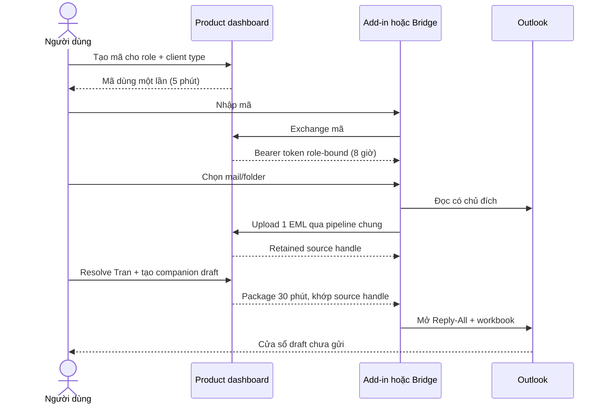

# Kết nối Outlook không cần Microsoft Graph

Tài liệu này giúp người dùng chọn giữa hai cách đưa mail Outlook vào
Asset Compensation Hub:

1. **Outlook Add-in** — chọn từng mail một, dễ dùng nhất.
2. **Local Bridge** — chọn cả folder, tiện khi có nhiều mail.

Cả hai cách đều:

- không dùng Microsoft Graph;
- không cần App Registration, client secret hay quyền Graph của admin;
- không biết mật khẩu Outlook của bạn;
- không có lệnh tự gửi mail;
- chỉ mở cửa sổ **Reply All** để bạn kiểm tra và tự bấm **Send**.

> Chính sách công ty vẫn là luật cao nhất. Công ty có thể chặn việc cài
> custom add-in hoặc việc chương trình truy cập Classic Outlook. Khi đó cần
> nhờ IT cho phép chính sách, dù hai cách này không xin quyền Microsoft Graph.

## Chọn nhanh trong 10 giây

| Câu hỏi | Nên chọn |
| --- | --- |
| Tôi chỉ xử lý vài mail và muốn cách dễ nhất | **Phương án 1 — Outlook Add-in** |
| Tôi dùng New Outlook, Outlook web hoặc không muốn cài Python | **Phương án 1**, nếu Outlook hỗ trợ Mailbox 1.14/1.15 và cho cài custom add-in |
| Tôi có nhiều mail trong một folder | **Phương án 2 — Local Bridge** |
| Tôi cần tách hai folder/mailbox cho NganTLT và TranNNB | **Phương án 2** |
| Mail thường có file đính kèm | **Phương án 2**; Bridge bỏ file đính kèm và chỉ chuyển phần chữ/HTML cần phân tích |
| Tôi không dùng Windows + Classic Outlook | **Phương án 1** |

## Mã ghép đôi là gì?

Hãy tưởng tượng Product là một cánh cửa. Product đưa cho bạn một
chiếc vé dùng một lần:

1. Bạn bấm **Tạo mã ghép đôi** trên Product.
2. Product hiện một mã ngắn.
3. Bạn chép mã vào Add-in hoặc Local Bridge.
4. Mã biến mất ngay sau khi dùng và tự hết hạn sau khoảng **5 phút**.
5. Công cụ nhận một phiên làm việc tối đa **8 giờ**.

Mã này không phải mật khẩu Outlook. Không gửi mã cho người khác. Mã
của Ngan, mã của Tran, mã Add-in và mã Bridge là những chiếc vé khác
nhau; không dùng lẫn.

## Phương án 1 — Outlook Add-in

### Nó giống cái gì?

Add-in giống một nút nhỏ được gắn ngay trong Outlook.

Bạn mở **một** bức thư, rồi nói: “Hãy mang đúng bức thư này sang
Product”. Add-in không đi lục cả hộp thư.

### Dùng Add-in thì chuyện gì sẽ xảy ra?

1. Bạn mở một mail báo mất/hư hỏng trong Outlook.
2. Bạn mở Add-in **Đưa vào Product**.
3. Bạn nhập mã ghép đôi của đúng phân hệ NganTLT hoặc TranNNB.
4. Bạn bấm **Đưa email này vào Product**.
5. Add-in chỉ lấy mail đang mở và Product tạo case như luồng upload EML
   hiện có.
6. Nếu là NganTLT, bạn tiếp tục review và làm hạch toán trên Product.
7. Nếu là TranNNB, bạn resolve dữ liệu và bấm **Đưa draft sang Add-in /
   Bridge** trên Product.
8. Add-in chỉ nhận draft khớp với đúng mail đang mở. Bạn bấm **Mở
   Reply All + workbook**.
9. Outlook mở cửa sổ trả lời, chèn nội dung và đính workbook.
10. Bạn đọc lại người nhận, nội dung và file. Chỉ bạn mới có thể
    bấm **Send**.

### Link tải trên Product

- [Tải Outlook Add-in (.xml)](/api/companion/downloads/outlook-addin-manifest.xml)
- Relative route: `/api/companion/downloads/outlook-addin-manifest.xml`
- Tên file tải xuống: `asset-compensation-hub-outlook.xml`.

File XML được Product tạo cho đúng địa chỉ server đang dùng. Không lấy file
XML của staging đem cài cho server khác.

### Cài Add-in một lần

1. Tải file XML bằng nút trên Product.
2. Trong Outlook, chọn **Get Add-ins / Tải phần bổ trợ**.
3. Chọn **Phần bổ trợ của tôi**.
4. Chọn **Thêm phần bổ trợ tùy chỉnh** → **Thêm từ Tệp**.
5. Chọn file XML vừa tải và chấp nhận cài đặt.
6. Nếu chưa thấy nút **Đưa vào Product**, đóng/mở Outlook rồi thử
   lại. Classic Outlook có thể cache add-in lâu hơn.

Có thể mở trang sideload Outlook của Microsoft tại
<https://aka.ms/olksideload>. Hướng dẫn Microsoft:
<https://learn.microsoft.com/office/dev/add-ins/outlook/sideload-outlook-add-ins-for-testing>.

### Add-in hợp khi nào?

- Bạn xử lý từng mail một.
- Bạn muốn ít bước cài nhất.
- Bạn dùng Outlook client hỗ trợ Office.js Mailbox 1.14/1.15.
- Bạn không cần quét cả folder.

### Giới hạn của Add-in

- Chỉ lấy mail đang mở; không quét folder.
- Xuất EML cần **Mailbox 1.14**.
- Mở Reply-All kèm workbook Base64 cần **Mailbox 1.15**. Máy chỉ có
  1.14 vẫn có thể nạp mail, nhưng phải dùng Local Bridge hoặc tải workbook
  thủ công để làm draft.
- Product chỉ nhận EML tối đa 2 MiB và không nhận EML có attachment. Add-in
  xuất mail nguyên gói, nên mail có file đính kèm có thể bị từ chối. Khi đó
  dùng Local Bridge nếu chỉ cần phần chữ/HTML.
- Nội dung draft Add-in bị chặn ở 32 KiB và workbook ở 25 MiB.
- Mã ghép đôi, token và bản ánh xạ mail chỉ nằm trong `sessionStorage`
  của task pane. Đóng/mở lại, hết hạn hoặc reset có thể phải ghép lại.
- Tenant có thể chặn custom add-in. Đây là chính sách Outlook, không phải
  quyền Microsoft Graph.

## Phương án 2 — Local Bridge cho Classic Outlook

### Nó giống cái gì?

Local Bridge giống một chiếc cầu có hai làn:

```text
Folder Ngan  ----\
                  >---- Local Bridge ----> Product
Folder Tran  ----/                           |
                                               +---- draft ----> Reply All mail gốc
```

Bạn tự chọn một folder cho Ngan và một folder cho Tran. Cây cầu chỉ nhìn
vào hai folder đó. Nó không chui vào folder khác.

### Dùng Local Bridge thì chuyện gì sẽ xảy ra?

1. Bạn mở **Classic Outlook** trên Windows.
2. Bạn mở **Asset Hub - Outlook Bridge** trên Desktop.
3. Bridge hiện sẵn địa chỉ Product trong một ô chỉ đọc. Nếu địa chỉ sai, không
   tự sửa ô đó; hãy tải lại ZIP từ đúng Product.
4. Trên Product, bạn tạo mã Local Bridge của Ngan và/hoặc Tran.
5. Bạn dán mã Ngan vào ô Ngan, mã Tran vào ô Tran. Hai mã giống hai
   chiếc chìa khóa cho hai ngăn tủ, không dùng chung.
6. Bạn bấm **Chọn thư mục** và chọn đúng folder/mailbox cho từng người.
7. Bạn bấm **Nạp mail mới**. Bridge lấy nhiều nhất 20 mail cũ nhất chưa xử lý
   trong cửa sổ 30 ngày. Nếu còn mail, bấm tiếp; nó đi lần lượt từ cũ tới mới và
   không bỏ qua phần còn lại.
8. Bridge tạo một EML nhỏ từ tiêu đề, người gửi/nhận, ngày,
   `Message-ID` và phần chữ/HTML. Nó không chép attachment.
9. Product phân tích EML và tạo case như bình thường.
10. NganTLT tiếp tục review/hạch toán trên Product. Ngan không có gói Reply-All.
11. TranNNB resolve dữ liệu và bấm **Đưa draft sang Add-in / Bridge**.
12. Trong Bridge, bạn bấm **Kiểm tra draft mới**, chọn một dòng và bấm **Mở
    Trả lời tất cả**.
13. Bridge tìm mail gốc bằng đúng `EntryID + StoreID`, gọi Outlook `ReplyAll()`,
    chèn nội dung, đính workbook, `Save()` rồi `Display()`.
14. Bridge không có thao tác `Send()`. Bạn đọc lại và tự bấm **Send**.

### Link tải trên Product

- [Tải Local Bridge (.zip)](/api/companion/downloads/local-bridge.zip)
- Relative route: `/api/companion/downloads/local-bridge.zip`
- Tên file tải xuống: `asset-hub-outlook-bridge.zip`.

ZIP được Product gắn sẵn địa chỉ server. Chỉ cài ZIP tải từ đúng Product
của công ty, không chạy bản do người lạ gửi.

### Cài Local Bridge một lần

Yêu cầu:

- Windows;
- Classic Outlook đã đăng nhập;
- Python 3.11 trở lên;
- mạng/proxy cho phép trình cài đặt tải `requests` và `pywin32`.

Các bước:

1. Tải ZIP bằng nút trên Product.
2. Giải nén ZIP.
3. Bấm chuột phải `install.ps1` → **Run with PowerShell**.
4. Chờ dòng **DA XONG!**.
5. Mở shortcut **Asset Hub - Outlook Bridge** trên Desktop.

Trình cài không cần quyền Administrator. Nó chép năm file chạy cần thiết từ
gói sáu file đã allowlist vào
`%LOCALAPPDATA%\AssetCompensationHub\OutlookBridge`, tạo virtual environment
riêng và tạo shortcut trên Desktop.

### Local Bridge hợp khi nào?

- Bạn dùng Classic Outlook trên Windows.
- Bạn cần nạp nhiều mail trong một folder.
- Bạn muốn chọn một folder/mailbox riêng cho Ngan và một folder/mailbox
  riêng cho Tran trong cùng Outlook profile.
- Mail có attachment nhưng Product chỉ cần phần chữ/HTML để phân tích.

### Nút “Tự kiểm tra 5 phút”

- Mặc định **tắt**.
- Khi bạn tự bật, Bridge cứ 5 phút kiểm tra folder đã chọn.
- Chỉ chạy khi cửa sổ Bridge còn mở.
- Không chạy chồng khi tác vụ trước chưa xong.
- Bỏ dấu chọn hoặc đóng Bridge là dừng.

Đây không phải robot nền 24/7 và không phải Windows service.

### Giới hạn của Local Bridge

- Chỉ chạy trên Windows + Classic Outlook. Không chạy với New Outlook, Outlook
  web, macOS, Linux hoặc như một cloud service.
- Chỉ nhìn ngay trong folder đã chọn; không quét folder con.
- Mỗi lần nhiều nhất 20 mail; chỉ xem tối đa 500 item mới nhất trong folder.
- EML tối đa 2 MiB. Attachment của mail nguồn không được chuyển sang Product.
- Token, folder, checkpoint, `EntryID`, `StoreID` và ánh xạ mail gốc chỉ ở RAM.
  Đóng Bridge là mất; lần sau phải ghép/chọn/nạp lại.
- Nếu mail gốc bị chuyển hoặc xóa, Bridge dừng và không đoán mail khác.
- Classic Outlook có thể hiện cảnh báo Object Model Guard. Chỉ cho phép nếu
  chính bạn vừa bấm nút trong Bridge.
- Bridge cần phiên desktop có người dùng. Không chạy bằng scheduled task
  không giao diện, service account hoặc trên Render.

## Hai phương án không thay Microsoft 365 Graph hiện có

Product vẫn có thể giữ luồng Microsoft 365/Graph là một tùy chọn riêng khi công
ty cấp quyền. Ba cách có mục đích khác nhau:

| Cách | Ai chọn mail? | Có thể chạy khi đóng Outlook? | Cần Graph/Entra? |
| --- | --- | --- | --- |
| Outlook Add-in | Người dùng mở từng mail | Không | Không |
| Local Bridge | Người dùng chọn exact folder trong Classic Outlook | Không | Không |
| Microsoft 365 hiện có | Product sync exact cloud folder đã chọn | Chỉ browser timer hiện tại; chưa có worker nền | Có |

Không cách nào trong MVP tự gửi mail.

## Phương án 3 được đề xuất — tự chuyển tiếp sang hộp thư riêng (CHƯA CÓ)

Đây mới là ý tưởng backlog. Product hiện **không có** nút tải, màn hình cấu hình,
worker hay API cho cách này.

Nếu sau này được duyệt và làm, cách hiểu rất đơn giản sẽ là:

1. Công ty tạo rule chuyển tiếp/copy đúng loại mail báo mất/hư hỏng sang một hộp
   thư chuyên dụng.
2. Product định kỳ nhìn vào hộp thư chuyên dụng đó và lấy mail mới.
3. Product tạo case và soạn nội dung draft.
4. Người dùng copy nội dung draft về Outlook công ty để trả lời thủ công.

Cách này không mở Reply-All trên chính mail gốc, vì Product không kết nối với
thread trong mailbox công ty. Nó cũng có rủi ro lớn hơn hai cách hiện có:

- nhiều tổ chức chặn auto-forward ra ngoài;
- mail công ty bị tạo thêm một bản sao trong hộp thư không do công ty quản lý;
- khó kiểm soát retention, xóa dữ liệu, audit, người sở hữu và sự cố rò rỉ;
- polling 24/7 cần worker/cursor bền vững, không thể dùng browser timer hay RAM
  session hiện tại.

Không triển khai bằng cách tự lấy mật khẩu/app password. Trước khi thiết kế cần:

1. văn bản phê duyệt của IT/Security/Data Owner cho đúng loại dữ liệu và đích
   chuyển tiếp;
2. chọn nhà cung cấp hộp thư và phương thức truy cập được phê duyệt;
3. chốt scope folder/filter, retention/delete/audit và trách nhiệm khi duplicate;
4. thiết kế worker, durable cursor, idempotency, retry, secret storage và
   monitoring cho 24/7;
5. UAT chứng minh không auto-send và không lấy mail ngoài scope.

Cho đến khi các điều kiện trên được chốt, không quảng bá phương án 3 như tính
năng hiện có và không dùng mailbox cá nhân với dữ liệu công ty thật.

## Lỗi thường gặp

### Mã không dùng được

- Mã đã dùng một lần, quá 5 phút, hoặc server vừa restart.
- Mã được tạo nhầm role hoặc nhầm loại client.
- Cách sửa: tạo mã mới ở đúng panel Ngan/Tran và đúng thẻ Add-in/Bridge.

### Product báo chưa bật lưu email nguồn

Cả hai cách cần `ASSET_HUB_RETAIN_RAW_EML=true`. Operator phải bật biến trên
server và restart/redeploy. Trên Render Free, redeploy có thể xóa toàn bộ dữ liệu
staging; phải lấy xác nhận mới trước khi làm.

### Add-in không xuất hiện

- Kiểm tra đã cài đúng XML tải từ đúng Product.
- Đóng/mở Outlook.
- Kiểm tra Outlook/tenant có cho custom add-in không.
- Kiểm tra client có Mailbox 1.14.
- Classic Outlook có thể cache manifest; trong trường hợp xấu có thể mất tới
  24 giờ để add-in sideload hiển thị.

### Add-in nạp được mail nhưng không mở Reply-All kèm workbook

- Kiểm tra client có Mailbox 1.15.
- Kiểm tra đang mở đúng mail đã nạp trong cùng phiên task pane.
- Kiểm tra Tran đã bấm **Đưa draft sang Add-in / Bridge**.
- Draft package chỉ chờ 30 phút; hết hạn thì tạo lại.
- Nếu bạn tạo lại draft cho cùng mail, Product tự bỏ package cũ
  khỏi hàng chờ và chỉ giữ bản mới nhất.
- Nếu body lớn hơn 32 KiB, dùng Local Bridge.

### Bridge không mở được Outlook

- Phải mở Classic Outlook trước.
- New Outlook không có COM nên không dùng được.
- Chạy lại `install.ps1` nếu thiếu `pywin32`.

### Bridge không thấy mail mới

- Kiểm tra đã chọn đúng exact folder. Bridge không nhìn folder con.
- Chỉ nhìn 30 ngày gần nhất và lấy tối đa 20 mail mỗi lượt.
- Nếu có nhiều hơn 20 mail, bấm nạp tiếp. Bridge lấy 20 mail cũ nhất chưa xử lý
  trước, nên các lượt sau sẽ đi tiếp tới mail mới hơn mà không bỏ qua backlog.

### Bridge báo không có mail gốc

- Phải là draft Tran của mail đã được chính Bridge này nạp trong phiên
  đang mở.
- Mail có thể đã bị di chuyển/xóa, hoặc Bridge đã đóng/mở lại.
- Bridge cố ý dừng thay vì đoán sang mail khác.

## Dành cho developer/AI: kiến trúc và API

### Luồng dữ liệu chung



### Route contract

| Auth | Method + route | Contract |
| --- | --- | --- |
| Basic Auth dashboard | `GET /api/companion/downloads/outlook-addin-manifest.xml` | Render manifest theo HTTPS origin hiện tại; download XML, no-store |
| Basic Auth dashboard | `GET /api/companion/downloads/local-bridge.zip` | ZIP allowlist sáu file; thay placeholder bằng HTTPS origin hiện tại; no-store |
| Public static, không chứa secret | `GET /outlook-addin/taskpane.html`, `/outlook-addin/taskpane.css`, `/outlook-addin/taskpane.js`, `/outlook-addin/logo.png` | Bốn exact task-pane assets; API dữ liệu vẫn cần pairing |
| Basic Auth dashboard + `X-Asset-Hub-Action: companion-pair-v1` | `POST /api/companion/pairings` | Exact JSON `{ "role": "ngan|tran", "client_type": "outlook_addin|local_bridge" }`; tạo code 5 phút |
| Mã dùng một lần | `POST /api/companion/exchange` | Exact JSON `{ "code": "..." }`; consume code, trả bearer token + role/client type + TTL |
| Bearer | `POST /api/companion/client/emails` | Exact multipart field `file`, 1 EML, header `X-Asset-Hub-Upload: companion-email-v1`; common validator/retention/ingestion |
| Basic Auth dashboard | `POST /api/tran/companion-drafts` | Exact Tran assets + row-level `source_bindings` + retained handle + approved `body_intro`; tạo workbook/package, never send |
| Bearer Tran | `GET /api/companion/client/draft-packages` | Chỉ các package chưa ack có exact retained handle mà session đã upload |
| Bearer Tran | `GET /api/companion/client/draft-packages/<32hex>` | Body HTML + workbook `.xlsx/.xlsm` Base64; recheck managed path/size |
| Bearer Tran + `X-Asset-Hub-Action: companion-ack-v1` | `POST /api/companion/client/draft-packages/<32hex>/ack` | Exact body `{}`; ẩn package khỏi danh sách của session; không có nghĩa mail đã gửi |

`/api/companion/exchange` và exact bearer routes là các ngoại lệ hẹp của shared
Basic Auth. Một đường dẫn `/api/companion/client/...` mới không tự động trở thành
public; allowlist trong `web/app.py` phải được cập nhật có chủ đích. Bearer token
chỉ đi trong `Authorization` header, không được đưa vào URL/query/log.

Mọi response `/api/companion/**` dùng `Cache-Control: private, no-store`. Invalid
code/token trả 401 với Bearer challenge; valid Ngan session gọi draft queue trả
403; package hết hạn/không thuộc source boundary trả 404; input sai trả 400; thiếu
retention/template capability trả 503 theo contract capability hiện có.

### Cấu hình public origin

Remote server phải set:

```text
ASSET_HUB_PUBLIC_ORIGIN=https://ten-product-cua-cong-ty.example
```

Render có thể dùng `RENDER_EXTERNAL_URL` làm fallback. Giá trị phải là exact
HTTPS origin, không có credential, path, query, fragment hoặc custom port.
`http://127.0.0.1:5000` và `http://localhost:5000` chỉ được phép cho local dev.

Server không tin `Host` header cho remote download. Nếu remote chưa set public
origin, download fail closed với 400 thay vì tạo XML/ZIP trỏ nhầm host. Add-in
manifest và `app.py` trong Bridge ZIP đều được render từ trusted origin này; file
source trong Git không chứa URL staging hard-code.

### TTL, bộ nhớ và giới hạn

| Dữ liệu | Giới hạn/hành vi |
| --- | --- |
| Pairing code | 12 ký tự dễ đọc chia 3 nhóm; one-time; 5 phút; tối đa 64 code trong process |
| Bearer session | Absolute 8 giờ; tối đa 128; raw token không lưu server |
| Draft package pointer | 30 phút; tối đa 256; package queue chỉ ở RAM |
| Retained handles/session | Tối đa 256; chỉ handle opaque, không phải Outlook item ID |
| Companion EML | Đúng 1 file/request; EML ≤2 MiB; request ≤3 MiB; common MIME/attachment bounds |
| Tran assets/package | 1–100 assets; mọi row cùng exact retained source binding |
| `body_intro` | 1–10.000 ký tự |
| Server package HTML | Tối đa 1.000.000 ký tự; Add-in áp bound hẹp hơn 32 KiB |
| Workbook | `.xlsx`/`.xlsm`, 1 byte–25 MiB, nằm đúng managed Tran output root |
| Add-in map | Tối đa 50 Outlook item → retained handle trong task-pane `sessionStorage` |
| Bridge scan | Cửa sổ 30 ngày; 20 mail cũ nhất chưa xử lý/lượt; repeat để drain; inspect tối đa 500 item/folder |
| Bridge checkpoint | Tối đa 2.000 EntryID trong RAM rồi co lại; không persist |

Server giữ **HMAC digest**, không giữ raw pairing code hoặc raw token. Pepper,
code digest, token digest, role/client binding, uploaded-handle set và package
queue đều chỉ nằm trong RAM của đúng web process. Restart/redeploy/test clear làm
mọi code/token/package mất hiệu lực.

Package TTL 30 phút chỉ là thời gian cho client lấy gói. Workbook đã generate và
retained EML/case vẫn đi theo retention của managed data hiện có; package hết hạn
không đồng nghĩa file đã được xóa ngay. Hiện chưa có retention TTL tự động cho
retained EML/output. `POST /api/test-data/clear` có xác nhận mới xóa managed test
data và drop companion state. Trên Render Free, restart/redeploy còn có thể xóa
toàn bộ `/tmp` staging.

### Ranh giới theo vai trò

- Pairing bind cả `role` và `client_type`; client phải kiểm lại response trước
  khi nhận token.
- Ngan và Tran cần code/token riêng.
- Cả hai role có thể upload EML vào pipeline chung.
- Chỉ Tran được list/get/ack draft package. Ngan nhận 403 nếu gọi draft queue.
- Draft chỉ hiện cho một Tran session đã ghi nhận exact retained handle do chính
  nó upload. Không tìm package bằng subject, tên file, Message-ID gần giống hay
  dữ liệu người dùng nhập.
- Add-in chỉ mở package nếu `source_eml_handle` khớp handle gắn với Outlook item
  hiện tại. Nếu hai Outlook item trong cùng phiên có bytes giống hệt và
  cùng handle, Add-in coi là mơ hồ và không mở cả hai.
- Bridge chỉ mở package nếu handle khớp map RAM tới exact `EntryID + StoreID`.
- Mỗi retained handle chỉ có một package chưa hết hạn: tạo bản mới
  atomically supersede bản cũ, nên client không thể mở nhầm số liệu cũ.

### Ranh giới Office.js Add-in

- Manifest xin đúng `ReadItem`; không xin `ReadWriteItem`.
- `getAsFileAsync` cần Mailbox 1.14 và lấy duy nhất message đang mở.
- `displayReplyAllFormAsync` cần Mailbox 1.9; attachment kiểu Base64 cần Mailbox
  1.15, nên UI yêu cầu 1.15 cho flow workbook.
- Task pane chỉ load Office.js chính thức từ
  `https://appsforoffice.microsoft.com` và asset cùng origin; không inline script.
- Token, role và item-source map ở `sessionStorage`, không `localStorage`.
- Fetch dùng same-origin relative path, `credentials: omit`, no-store, không follow
  redirect, timeout 45 giây và bounded response.
- Client validate package ID, exact source handle, safe HTML, workbook name/type,
  Base64 và size trước khi gọi Outlook.
- Không có call gửi mail.

### Ranh giới Classic Outlook COM

- COM nằm hoàn toàn trong app tải về, không chạy trên server.
- Product origin được đóng vào ZIP và hiển thị read-only. HTTP client của
  **Local Bridge** chỉ chấp nhận HTTPS remote hoặc loopback HTTP, không
  credential/path/query; không follow
  redirect và dùng connect/read timeout 5/30 giây.
- Chỉ `Dispatch("Outlook.Application")` trong interactive Windows session.
- Folder được chọn bằng `PickFolder()`; không enumerate cả mailbox theo đường dẫn
  tự đoán và không recurse folder con.
- Read không set `UnRead`, không move/delete item và không tải attachment.
- EML tối thiểu giữ `Message-ID` nếu lấy được từ transport headers, nhưng bỏ
  attachment có chủ đích.
- Source map `handle → EntryID + StoreID` chỉ ở RAM của Bridge; hai Outlook ID
  không được gửi lên server.
- Draft body được sanitize lại; workbook được Base64-validate, giới hạn 25 MiB,
  kiểm ZIP/Office signature và chỉ ghi vào temporary directory.
- Exact item được mở bằng `GetItemFromID`; failure dừng, không fuzzy search.
- Adapter chỉ gọi `ReplyAll()`, thêm attachment, `Save()` và `Display()`. Source
  được kiểm bằng AST regression để không có member `Send`.
- Có thể xuất hiện Outlook Object Model Guard; không hướng dẫn tắt bảo mật toàn
  cục.

### Threat boundary và việc chưa phải production

Đã có:

- dashboard mới tạo được pairing code sau shared Basic Auth và exact action
  header;
- code/token lookup dùng constant-time compare trong bounded store;
- raw secret không persist và không nằm trong URL;
- role/client/source binding fail closed;
- EML luôn qua validator, retention và ingestion authoritative hiện có;
- HTML/workbook/output path được validate lại ở server và client;
- static task pane/installer không chứa credential;
- không có send endpoint hoặc send member ở hai client.

Chưa có:

- rate limiter riêng cho endpoint exchange;
- SSO/RBAC/per-user audit/revocation server-side;
- nút revoke tức thì cho bearer token. Disconnect local chỉ xóa bản token ở
  client; server session tự hết hạn, mất khi restart hoặc test clear;
- chữ ký code/installer doanh nghiệp, automatic update hoặc package signing;
- encrypted durable session/package store cho multi-worker;
- malware/DLP scan cho EML/workbook;
- formal retention TTL/secure deletion.

Vì vậy đây là companion cho staging/private single-instance MVP, chưa phải một
gateway Outlook production nhiều người dùng.

## QA cho developer/AI

### Lệnh tự động

```powershell
ruff check .
pytest -q tests/test_companion_service.py `
  tests/test_companion_routes.py `
  tests/test_companion_downloads.py `
  tests/test_outlook_addin_assets.py `
  tests/test_local_bridge_assets.py
node --check src/asset_compensation/integrations/outlook_addin/taskpane.js
pnpm --dir frontend build
git diff --check
```

Không ghi số test/SHA release vào tài liệu này nếu chưa chạy gate trên exact
commit. Full release vẫn phải chạy `pytest --cov=asset_compensation` và các gate
trong `PROJECT_CONTEXT.md`.

### UAT Add-in bằng dữ liệu synthetic

1. Xác nhận download XML dùng đúng HTTPS origin và không chứa placeholder.
2. Cài XML vào Outlook test.
3. Tạo code Add-in cho Ngan, pair, mở một EML synthetic không attachment và upload.
4. Xác nhận chỉ mail đang mở được nạp; mail khác trong folder không thay đổi.
5. Ngắt kết nối; tạo code Tran mới, upload một LOST mail synthetic.
6. Trên Product resolve và tạo companion draft.
7. Mở đúng mail, đợi/làm mới package, bấm Reply-All.
8. Xác nhận đúng thread/người nhận, body đã escape, workbook đúng template và
   form vẫn chưa gửi.
9. Hủy draft test; không bấm Send.

### UAT Local Bridge bằng dữ liệu synthetic

1. Cài ZIP trên máy Windows test có Classic Outlook.
2. Tạo hai code riêng, pair Ngan + Tran.
3. Chọn hai exact folder synthetic khác nhau.
4. Nạp mail; xác nhận tối đa 20, không mark read/move/delete và không recurse.
5. Xác nhận attachment nguồn không được chuyển sang Product.
6. Tạo Tran companion draft trên Product.
7. Bấm kiểm tra/mở draft; xác nhận Bridge bỏ qua Ngan draft queue, match đúng
   Tran source, mở Reply-All, attach workbook, save/display nhưng không send.
8. Di chuyển/xóa một mail synthetic rồi thử package tương ứng; Bridge phải dừng,
   không đoán mail khác.
9. Đóng Bridge và mở lại; xác nhận token/folder/checkpoint/source map đã mất.

### Kiểm tra download/package

- Manifest chỉ xin `ReadItem`, dùng Mailbox 1.14 và mọi URL phải là exact HTTPS
  origin đang phục vụ.
- Local ZIP chỉ có `app.py`, `core.py`, `install.ps1`, `start.cmd`,
  `requirements.txt`, `README.txt`; không có `.env`, token, log hay dữ liệu mail.
- `app.py` trong ZIP phải được thay hết `__ASSET_HUB_ORIGIN__`; source package
  trong Git vẫn giữ đúng một placeholder để render runtime.
- Hai download route cần Basic Auth và `private, no-store`; static task pane được
  public có chủ đích nhưng không được chứa secret.
- Unknown companion client route không được tự bypass Basic Auth.
